# Backend Feature Reference

This document covers backend features F-20 to F-44: the multi-agent pipeline, retrieval engine, profiling system, resilience mechanisms and deployment infrastructure. For system-level requirements, use cases and the feature traceability matrix, see [architecture.md](./architecture.md). For frontend features, see [frontend.md](./frontend.md).

All file paths are relative to `fyp_codebase/Lifelong-Learning-App/`.

---

## Server-Side SSE Overview

**Source:** `agents/controllerAgent.ts`, `app/api/chat/route.ts`

The server serialises agent responses into typed SSE frames before writing them to the response stream. Each frame follows the format `event: <type>\ndata: <JSON>`. The choice of serialisation mechanism depends on how the response was generated.

**Path 1: Rolling Tag-Detection State Machine (faq and general intents).**
The LLM produces tokens incrementally inside `graph.streamEvents()`. A rolling state machine in `handleMessage()` processes the raw token stream using boolean flags (`inThought`, `inFollowUp`) and rolling buffers (`pendingBuffer`, `thoughtBuffer`, `followUpBuffer`). The `longestTagPrefix()` helper holds back trailing bytes that could begin a watched tag (`<thought>`, `[FOLLOW_UP]:`), deferring emission until the next chunk confirms or denies the tag. This ensures no marker is ever partially exposed as visible plaintext.

**Path 2: Post-Graph Structured Response Parser (recommendation, comparison and learning_path intents).**
Specialist nodes construct the full response deterministically before any output exists. After `streamEvents()` completes, `parseAndEmitStructuredResponse()` performs a single-pass parse of the complete `responseText` string and emits events in a fixed order:

```
thought → recommendation_meta → token → course_card × n → follow_up
```

This approach ensures correctness: layout-dependent rendering (accordion grouping, side-by-side comparison) always operates on the complete set of results rather than a partial stream.

| Emitted Event | Source | When |
|--------------|--------|------|
| `token` | Rolling state machine / post-graph parser | Incrementally for faq/general; once for structured intents |
| `thought` | Rolling state machine (extracts `<thought>…</thought>` blocks) | Before user-visible text |
| `course_card` | Post-graph parser | Once per course in structured responses |
| `follow_up` | Rolling state machine / post-graph parser | After content, from `[FOLLOW_UP]: Q1\|Q2\|Q3` |
| `recommendation_meta` | Post-graph parser | Once per structured response |
| `section_header` | Post-graph parser | Between course groups in comparison and learning-path responses |
| `block` | `handleMessage()` directly | When input or output validation fails; stream terminates |
| `hallucination_warning` | `handleMessage()` directly | When output guard Layer 3 returns high grounding risk |
| `done` | `handleMessage()` directly | Final event in every response stream |

For the client-side view of these events and the ingestion pipeline, see [frontend.md — Client-Side SSE Overview](./frontend.md#client-side-sse-overview). For the full server-side implementation detail including the JSON leak filter, see [F-40](#f-40-communication-protocols-sse-and-json-leak-filter).

---

## F-20: 6-Node LangGraph StateGraph

**Source:** `agents/chatGraph.ts`, `agents/agentSetup.ts`

The chatbot backend is a multi-agent pipeline orchestrated by a LangGraph `StateGraph`. The graph comprises six nodes interconnected by conditional edges, forming a directed state machine.

Three nodes are backed by agents that invoke an LLM for reasoning and structured output: `InputGuardNode`, `ControllerNode` and `OutputGuardNode`. The remaining three specialist nodes (`RecommenderNode`, `ComparerNode` and `LearningPathNode`) perform deterministic retrieval via semantic search and Firestore queries without LLM calls.

The compiled `StateGraph` is stored as a module-level singleton via `getChatGraph()`, eliminating graph recompilation on repeated requests to the same warm serverless instance.

The pipeline operates across two tiers on every request. The **critical-path tier** is the `StateGraph` itself: it synchronously processes user messages and streams a response. The **off-critical-path tier** is coordinated by the `analyseAndProfileUser()` orchestrator: it asynchronously extracts learning signals and persists an updated user profile to Firestore after the stream closes. The updated profile is used in the next request to personalise the response.

The shared state type is defined using LangGraph's `Annotation.Root` pattern. Key fields:

| Field group | Fields |
|------------|--------|
| Input (set before graph entry) | `userMessage`, `userId`, `profile`, `messages`, `contextText`, `isValid`, `blockReason`, `intent`, `searchQuery`, `secondaryQuery` |
| ControllerNode output | `intent` (confirmed), `responseText` (for faq/general intents) |
| OutputGuardNode output | `outputSafe`, `outputHallucinationRisk`, `outputSafetyReasons` |

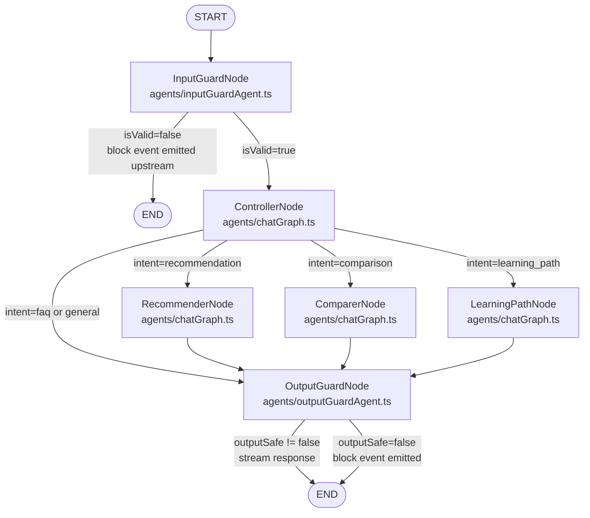
```mermaid
flowchart TD
    S([START]) --> IG["InputGuardNode\nagents/inputGuardAgent.ts"]
    IG -- "isValid=false\nblock event emitted upstream" --> E([END])
    IG -- isValid=true --> CN["ControllerNode\nagents/chatGraph.ts"]
    CN -- "intent=recommendation" --> RN["RecommenderNode\nagents/chatGraph.ts"]
    CN -- "intent=comparison" --> ComN["ComparerNode\nagents/chatGraph.ts"]
    CN -- "intent=learning_path" --> LPN["LearningPathNode\nagents/chatGraph.ts"]
    CN -- "intent=faq or general" --> OG["OutputGuardNode\nagents/outputGuardAgent.ts"]
    RN --> OG
    ComN --> OG
    LPN --> OG
    OG -- "outputSafe != false\nstream response" --> E2([END])
    OG -- "outputSafe=false\nblock event emitted" --> E2
```

---

## F-21: Speculative Parallel Pre-Execution

**Source:** `agents/controllerAgent.ts`, `lib/userProfileService.ts`, `agents/inputGuardAgent.ts`, `agents/chatGraph.ts`

To minimise time-to-first-token, three independent I/O operations are dispatched concurrently via `Promise.all` before the `StateGraph` is invoked:

```typescript
const [profile, validation, classification] = await Promise.all([
  buildEffectiveUserProfile(context?.userId ?? ""),
  validateInput(userMessage),
  classifyIntent(userMessage, messages),
]);
```

All three results are injected into the initial `AgentState`, so each graph node can proceed without re-performing these lookups. `classifyIntent()` is executed outside `graph.streamEvents()` to prevent its structured-output JSON from leaking into the SSE token stream.

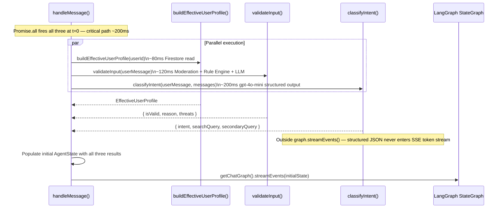
```mermaid
sequenceDiagram
    participant HM as handleMessage()
    participant UPS as buildEffectiveUserProfile()
    participant IG as validateInput()
    participant CI as classifyIntent()
    participant SG as LangGraph StateGraph

    Note over HM: Promise.all fires all three at t=0 — critical path ~200ms
    par Parallel execution
        HM->>UPS: buildEffectiveUserProfile(userId)\n~80ms Firestore read
        HM->>IG: validateInput(userMessage)\n~120ms Moderation + Rule Engine + LLM
        HM->>CI: classifyIntent(userMessage, messages)\n~200ms gpt-4o-mini structured output
    end
    UPS-->>HM: EffectiveUserProfile
    IG-->>HM: { isValid, reason, threats }
    CI-->>HM: { intent, searchQuery, secondaryQuery }
    Note over CI: Outside graph.streamEvents() — structured JSON never enters SSE token stream
    HM->>HM: Populate initial AgentState with all three results
    HM->>SG: getChatGraph().streamEvents(initialState)
```

---

## F-22: Input Guard Agent

**Source:** `agents/inputGuardAgent.ts`, `agents/pipelineConfig.json`

The Input Guard agent implements a four-layer input validation pipeline executed before the `StateGraph` is entered. Layers execute in sequence and short-circuit on failure. A false result from any layer emits a `block` SSE event and terminates the stream without invoking the graph.

**Layer 1: Input Length Limit.**
Inputs exceeding `maxInputLength` (2,000 characters) are rejected at zero network cost, preventing resource exhaustion from oversized payloads.

**Layer 2: Deterministic Rule Engine.**
Five weighted regex-pattern groups cover five attack categories. The cumulative score is capped at 1.0 and blocked when it reaches `inputBlockThreshold` (0.8). Because this layer uses only regex with no network call, it short-circuits obvious attacks at zero latency.

| Rule ID | Attack Category | Sample Patterns | Weight |
|---------|----------------|----------------|--------|
| `instruction_override` | Prompt Injection: Override | `ignore previous`, `system override` | 0.9 |
| `persona_hijack` | Prompt Injection: Persona | `you are now`, `act as a`, `DAN mode` | 0.7 |
| `system_leakage` | Data Leakage | `reveal your prompt`, `show initial instructions` | 1.0 |
| `sensitive_data_extraction` | Data Extraction | `api key`, `access token`, `dump the database` | 0.7 |
| `markdown_exfiltration` | Markdown Injection | Inline image URLs, `javascript:` href patterns | 0.6 |

**Layer 3: OpenAI Moderation API.**
Inputs that bypass the rule engine are submitted to the OpenAI Moderation API, which classifies them across eleven harm categories. If the moderation API is unavailable, this layer fails open and the input proceeds to Layer 4.

**Layer 4: LLM Semantic Analysis.**
Inputs passing Layers 1, 2 and 3 are processed by a `gpt-4o-mini` instance with `withStructuredOutput` enforcing a Zod schema (`isValid`, `reason`, `threats`, `sanitizedInput`). This layer performs semantic analysis to detect adversarial inputs that do not match deterministic patterns. The `sanitizedInput` field is propagated downstream in place of the raw user message. If the LLM call fails, this layer fails open and returns the Layer 2 result.

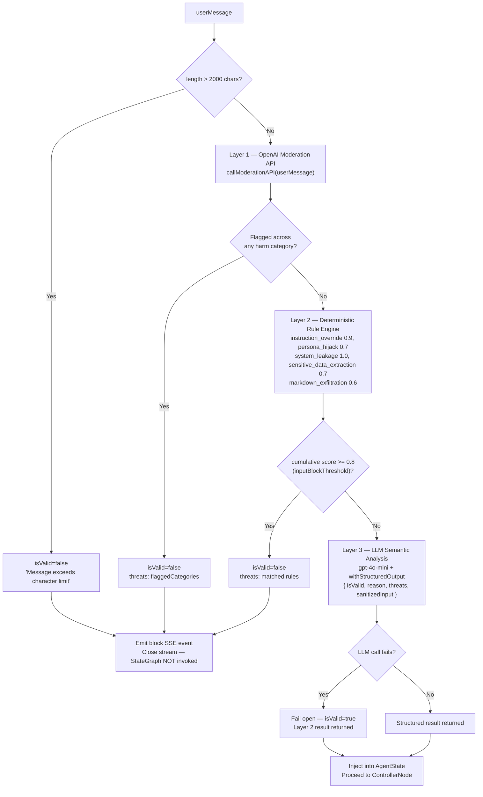
```mermaid
flowchart TD
    A[userMessage] --> B{"length > 2000 chars?"}
    B -- Yes --> BLOCK0["isValid=false\n'Message exceeds character limit'"]
    B -- No --> L1["Layer 1 — OpenAI Moderation API\ncallModerationAPI(userMessage)"]
    L1 --> C{Flagged across\nany harm category?}
    C -- Yes --> BLOCK1["isValid=false\nthreats: flaggedCategories"]
    C -- No --> L2["Layer 2 — Deterministic Rule Engine\ninstruction_override 0.9, persona_hijack 0.7\nsystem_leakage 1.0, sensitive_data_extraction 0.7\nmarkdown_exfiltration 0.6"]
    L2 --> D{"cumulative score >= 0.8\n(inputBlockThreshold)?"}
    D -- Yes --> BLOCK2["isValid=false\nthreats: matched rules"]
    D -- No --> L3["Layer 3 — LLM Semantic Analysis\ngpt-4o-mini + withStructuredOutput\n{ isValid, reason, threats, sanitizedInput }"]
    L3 --> E{LLM call fails?}
    E -- Yes --> FO["Fail open — isValid=true\nLayer 2 result returned"]
    E -- No --> L3R[Structured result returned]
    BLOCK0 & BLOCK1 & BLOCK2 --> EXIT1[Emit block SSE event\nClose stream — StateGraph NOT invoked]
    FO & L3R --> EXIT2[Inject into AgentState\nProceed to ControllerNode]
```

---

## F-23: Output Guard Agent

**Source:** `agents/outputGuardAgent.ts`, `agents/pipelineConfig.json`

The Output Guard agent implements a four-layer output validation pipeline executed within `OutputGuardNode` after response generation is complete. The two guard agents form a defence-in-depth arrangement: both use deterministic rule engines as the primary line of defence and invoke LLMs only for edge cases that pattern-matching cannot resolve.

**Layer 1: Deterministic Rule Engine.**
Three rules detect policy violations. The cumulative score is capped at 1.0 and a response is blocked once it reaches `outputBlockThreshold` (0.9). No single rule carries a weight of 0.9 or higher, so blocking requires at least two rules to trigger simultaneously, reducing the chance of suppressing legitimate responses.

| Rule ID | Policy Category | Sample Patterns | Weight |
|---------|----------------|----------------|--------|
| `out_of_scope_promotion` | Competitor Promotion | `you should buy [competitor]`, `switch to a competitor` | 0.8 |
| `ai_refusal` | Hallucination / Refusal | `as an AI language model`, `I cannot fulfill this` | 0.4 |
| `pii_leak` | PII Leakage | Singapore NRIC, email address, phone number, credit card number, SSN | 0.8 |

**Layer 2: OpenAI Moderation API.**
The generated response is submitted to the same moderation API used for input validation, detecting harmful content that may have been introduced by indirect prompt manipulation during generation.

**Layer 3: Deterministic Grounding Heuristic.**
`assessGroundingRisk()` checks the response for data-source provenance markers (`[COURSE_CARD]`, `[FAQ_RESULT]`, `[RECOMMENDATION_META]`) rather than relying on LLM self-evaluation. Outputs containing these markers are classified as low risk. A single external-claim pattern yields medium risk; two or more yields high risk. A high-risk rating triggers the `hallucination_warning` SSE event without blocking the stream.

After `validateOutput` returns, `OutputGuardNode` applies an intent-aware override using the `isGrounded` state field set by `ControllerNode`. The `isGrounded` field is `true` for retrieval-backed intents (recommendation, comparison, learning path) and for FAQ responses where the platform knowledge tool returned a `[FAQ_RESULT]` match above `faqSimilarityThreshold` (0.4). It is `false` for `general` intent (no retrieval source) and for FAQ responses where no matching document was found. Two overrides are applied:

| Condition | Override | Rationale |
|---|---|---|
| `intent === "faq"` and `!isGrounded` | Force `"high"` | The LLM answered from pre-training knowledge with no matching platform document |
| `intent === "general"` and `risk === "medium"` | Promote to `"high"` | Lowers the external-claim threshold from 2 matches to 1 for ungrounded general responses |

Conversational responses (greetings, study advice) contain no external-claim patterns and remain `"low"` under both paths. The acknowledged limitation is that declarative factual prose with zero citation phrases scores `"low"` regardless of grounding status; resolving this fully would require an LLM-based factual-claim classifier.

**Layer 4: LLM Policy Compliance.**
Outputs passing Layers 1 and 2 are processed by a `gpt-4o-mini` instance with `withStructuredOutput` enforcing a Zod schema (`isSafe`, `policyCompliant`, `reasons`). If the LLM call fails, the guard reverts to Layers 1 and 2 at a conservative `outputFallbackThreshold` (0.5). The final `outputSafe` flag uses strict equality (`=== false`) so that `undefined` from intermediate graph state snapshots is never misinterpreted as a safety block.

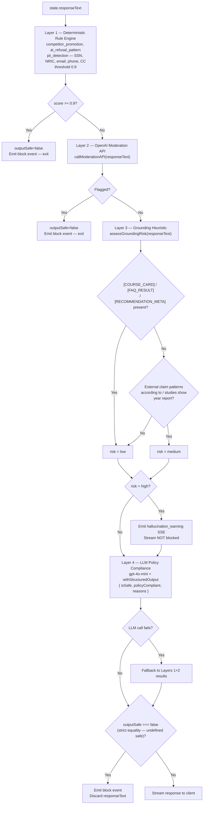
```mermaid
flowchart TD
    A[state.responseText] --> L1["Layer 1 — Deterministic Rule Engine\ncompetitor_promotion, ai_refusal_pattern\npii_detection — SSN, NRIC, email, phone, CC\nthreshold 0.9"]
    L1 --> B{"score >= 0.9?"}
    B -- Yes --> BLOCK1[outputSafe=false\nEmit block event — exit]
    B -- No --> L2["Layer 2 — OpenAI Moderation API\ncallModerationAPI(responseText)"]
    L2 --> C{Flagged?}
    C -- Yes --> BLOCK2[outputSafe=false\nEmit block event — exit]
    C -- No --> L3["Layer 3 — Grounding Heuristic\nassessGroundingRisk(responseText)"]
    L3 --> D{"[COURSE_CARD] / [FAQ_RESULT]\n/ [RECOMMENDATION_META] present?"}
    D -- Yes --> LOW[risk = low]
    D -- No --> E{External claim patterns\naccording to / studies show\nyear report?}
    E -- Yes --> MED[risk = medium]
    E -- No --> LOW
    LOW & MED --> F{risk = high?}
    F -- Yes --> WARN[Emit hallucination_warning SSE\nStream NOT blocked]
    F -- No --> L4
    WARN --> L4["Layer 4 — LLM Policy Compliance\ngpt-4o-mini + withStructuredOutput\n{ isSafe, policyCompliant, reasons }"]
    L4 --> G{LLM call fails?}
    G -- Yes --> FB[Fallback to Layers 1+2 results]
    G -- No --> H
    FB --> H{"outputSafe === false\n(strict equality — undefined safe)?"}
    H -- Yes --> BLOCK3[Emit block event\nDiscard responseText]
    H -- No --> STREAM[Stream response to client]
```

---

## F-24: Intent Classification and Routing

**Source:** `agents/chatGraph.ts`, `agents/controllerAgent.ts`

Intent classification is performed by `classifyIntent()` in `agents/chatGraph.ts`, invoked during speculative pre-execution (see [F-21](#f-21-speculative-parallel-pre-execution)). The function binds a `gpt-4o-mini` instance to a Zod schema via `withStructuredOutput` at `temperature: 0` to enforce deterministic routing decisions:

```typescript
const intentSchema = z.object({
  intent:         z.enum(["recommendation", "faq", "general", "comparison", "learning_path"]),
  searchQuery:    z.string(),
  secondaryQuery: z.string(),
});
```

Schema enforcement constrains the LLM output to a finite set of valid routing targets. The classifier receives the last `classifierHistoryDepth` (5) turns of conversation history, providing context for disambiguation. In the event of any LLM or network failure, `classifyIntent()` falls back to the `general` intent.

The classified `state.intent` field drives routing through the `routeAfterController()` conditional edge function:

| Classified Intent | Target Node | Behaviour |
|------------------|------------|-----------|
| `recommendation` | `RecommenderNode` | Hybrid semantic retrieval; course cards returned without LLM call |
| `comparison` | `ComparerNode` | Parallel retrieval on two topics; side-by-side course cards |
| `learning_path` | `LearningPathNode` | Three-level retrieval (beginner, intermediate, advanced); roadmap output |
| `faq` / `general` | `OutputGuardNode` | Response already generated by `ControllerNode`; specialist nodes bypassed |

The extracted `searchQuery` and `secondaryQuery` fields are passed into graph state, so specialist nodes receive a pre-processed topic string rather than the raw user message, avoiding redundant LLM topic extraction calls within the graph.

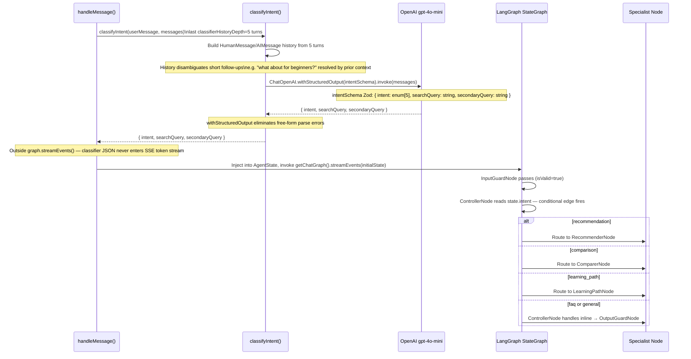
```mermaid
sequenceDiagram
    participant HM as handleMessage()
    participant CI as classifyIntent()
    participant OAI as OpenAI gpt-4o-mini
    participant SG as LangGraph StateGraph
    participant SP as Specialist Node

    HM->>CI: classifyIntent(userMessage, messages)\nlast classifierHistoryDepth=5 turns
    CI->>CI: Build HumanMessage/AIMessage history from 5 turns
    Note over CI: History disambiguates short follow-ups\ne.g. "what about for beginners?" resolved by prior context
    CI->>OAI: ChatOpenAI.withStructuredOutput(intentSchema).invoke(messages)
    Note over OAI: intentSchema Zod: { intent: enum[5], searchQuery: string, secondaryQuery: string }
    OAI-->>CI: { intent, searchQuery, secondaryQuery }
    Note over CI: withStructuredOutput eliminates free-form parse errors
    CI-->>HM: { intent, searchQuery, secondaryQuery }
    Note over HM: Outside graph.streamEvents() — classifier JSON never enters SSE token stream
    HM->>SG: Inject into AgentState, invoke getChatGraph().streamEvents(initialState)
    SG->>SG: InputGuardNode passes (isValid=true)
    SG->>SG: ControllerNode reads state.intent — conditional edge fires
    alt recommendation
        SG->>SP: Route to RecommenderNode
    else comparison
        SG->>SP: Route to ComparerNode
    else learning_path
        SG->>SP: Route to LearningPathNode
    else faq or general
        SG->>SP: ControllerNode handles inline → OutputGuardNode
    end
```

---

## F-25: Controller Node: FAQ and General Responses

**Source:** `agents/controllerAgent.ts`, `agents/chatGraph.ts`, `agents/agentConfig.json`

The `ControllerNode` handles both `faq` and `general` intents. For all other intents the node sets up the initial state and forwards execution to the relevant specialist node. Its execution logic is partitioned into three phases.

**Contextual Injection.**
For each request, `generatePersonalisationContext()` aggregates the user's interests, skill level and Bloom's cognitive level to construct a personalisation suffix appended to the system prompt. The nine most recent messages (`controllerHistoryDepth` = 9) are included in the context to maintain multi-turn conversational coherence.

**Intent-Based Grounding.**
For `faq` intent, the `platformKnowledgeTool` is invoked and its result is prepended to the user turn before the LLM call, grounding the response in retrieved documentation. For `general` intent, the model answers using only its parametric knowledge.

**Output Structure.**
The node uses a `gpt-4o-mini` instance (temperature 0.1, max 5,000 tokens as configured in `agentConfig.json`) to structure its reasoning within a `<thought>` block using four ordered sub-tags (`[CLASSIFIER]`, `[RESEARCHER]`, `[CURATOR]`, `[SAFETY]`) before writing the user-facing response. The response concludes with three follow-up questions in the `[FOLLOW_UP]: Q1 | Q2 | Q3` format.

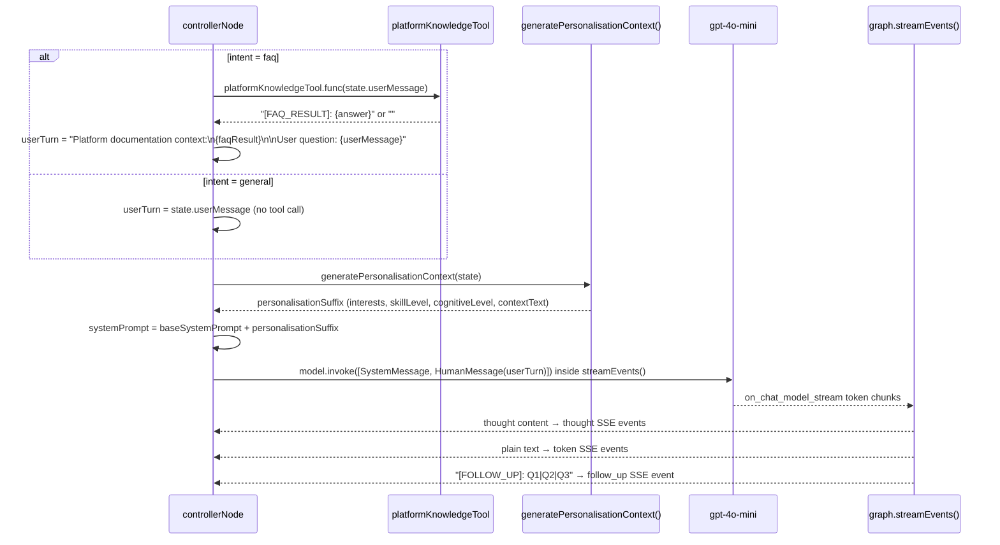
```mermaid
sequenceDiagram
    participant CN as controllerNode
    participant PKT as platformKnowledgeTool
    participant GPC as generatePersonalisationContext()
    participant OAI as gpt-4o-mini
    participant SE as graph.streamEvents()

    alt intent = faq
        CN->>PKT: platformKnowledgeTool.func(state.userMessage)
        PKT-->>CN: "[FAQ_RESULT]: {answer}" or ""
        CN->>CN: userTurn = "Platform documentation context:\n{faqResult}\n\nUser question: {userMessage}"
    else intent = general
        CN->>CN: userTurn = state.userMessage (no tool call)
    end
    CN->>GPC: generatePersonalisationContext(state)
    GPC-->>CN: personalisationSuffix (interests, skillLevel, cognitiveLevel, contextText)
    CN->>CN: systemPrompt = baseSystemPrompt + personalisationSuffix
    CN->>OAI: model.invoke([SystemMessage, HumanMessage(userTurn)]) inside streamEvents()
    OAI-->>SE: on_chat_model_stream token chunks
    SE-->>CN: thought content → thought SSE events
    SE-->>CN: plain text → token SSE events
    SE-->>CN: "[FOLLOW_UP]: Q1|Q2|Q3" → follow_up SSE event
```

---

## F-26: Platform Knowledge RAG Tool

**Source:** `agents/chatGraph.ts`, `lib/redis.ts`

`platformKnowledgeTool` is a LangChain `DynamicTool` implementing RAG over the `platformDocs` Firestore collection. For `faq` intent, `ControllerNode` invokes it directly and injects the result into the prompt (see [F-25](#f-25-controller-node-faq-and-general-responses)).

**Fetching Mechanism.**
Platform documents are retrieved from Upstash Redis (`chatbot:platform_docs`, 3,600-second TTL) and fall back to Firestore on a cache miss. The user query is embedded via `text-embedding-3-small` and the single highest-scoring document is selected by cosine similarity.

**Successful Query.**
If a document exceeds `faqSimilarityThreshold` (0.4), its content is returned prefixed with `[FAQ_RESULT]:`. This marker serves a dual purpose: it signals to the `ControllerNode` that grounded evidence is available, and it provides a provenance marker for the Output Guard's grounding heuristic (Layer 3 of [F-23](#f-23-output-guard-agent)), which classifies responses containing this marker as low risk.

**Unsuccessful Query.**
If no document exceeds the threshold, a default response is returned to inform the user that the information could not be found.

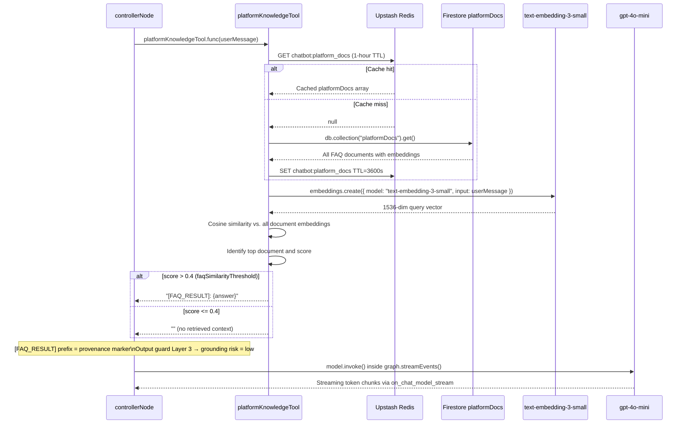
```mermaid
sequenceDiagram
    participant CN as controllerNode
    participant PKT as platformKnowledgeTool
    participant RD as Upstash Redis
    participant FS as Firestore platformDocs
    participant OAI as text-embedding-3-small
    participant LLM as gpt-4o-mini

    CN->>PKT: platformKnowledgeTool.func(userMessage)
    PKT->>RD: GET chatbot:platform_docs (1-hour TTL)
    alt Cache hit
        RD-->>PKT: Cached platformDocs array
    else Cache miss
        RD-->>PKT: null
        PKT->>FS: db.collection("platformDocs").get()
        FS-->>PKT: All FAQ documents with embeddings
        PKT->>RD: SET chatbot:platform_docs TTL=3600s
    end
    PKT->>OAI: embeddings.create({ model: "text-embedding-3-small", input: userMessage })
    OAI-->>PKT: 1536-dim query vector
    PKT->>PKT: Cosine similarity vs. all document embeddings
    PKT->>PKT: Identify top document and score
    alt score > 0.4 (faqSimilarityThreshold)
        PKT-->>CN: "[FAQ_RESULT]: {answer}"
    else score <= 0.4
        PKT-->>CN: "" (no retrieved context)
    end
    Note over CN: [FAQ_RESULT] prefix = provenance marker\nOutput guard Layer 3 → grounding risk = low
    CN->>LLM: model.invoke() inside graph.streamEvents()
    LLM-->>CN: Streaming token chunks via on_chat_model_stream
```

---

## F-27: Recommender Node

**Source:** `agents/chatGraph.ts`

The `RecommenderNode` handles the `recommendation` intent. It employs a multi-stage retrieval strategy to ensure high availability of course suggestions.

**Retrieval Process.**
1. `getRecommendationsWithCache()` first attempts to retrieve results from the Upstash Redis recommendation layer (`chatbot:rec:{userId}:{query}`, 300-second TTL).
2. On a cache miss, `getSemanticRecommendations()` executes the full hybrid retrieval process (see [F-28](#f-28-hybrid-retrieval-engine-dense-bm25-rrf) and [F-29](#f-29-content-reranking-and-mmr)).
3. If semantic retrieval fails, the top eight free vendor courses by enrolment are served from the Vercel Data Cache as a hard fallback.

**Output Construction.**
The node constructs a structured `responseText` string incorporating `<thought>`, `[COURSE_CARD]`, `[FOLLOW_UP]` and `[RECOMMENDATION_META]` tags without any LLM call. This eliminates the latency cost of a separate generation step for structured recommendation responses. Fallback results are not cached to ensure subsequent requests retry the live pipeline.

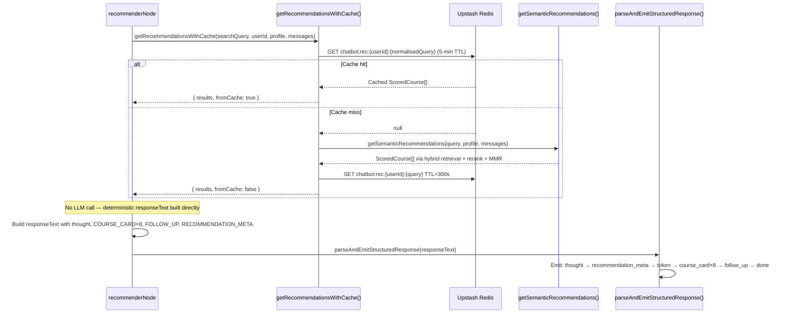
```mermaid
sequenceDiagram
    participant RN as recommenderNode
    participant GRC as getRecommendationsWithCache()
    participant RD as Upstash Redis
    participant SR as getSemanticRecommendations()
    participant PE as parseAndEmitStructuredResponse()

    RN->>GRC: getRecommendationsWithCache(searchQuery, userId, profile, messages)
    GRC->>RD: GET chatbot:rec:{userId}:{normalisedQuery} (5-min TTL)
    alt Cache hit
        RD-->>GRC: Cached ScoredCourse[]
        GRC-->>RN: { results, fromCache: true }
    else Cache miss
        RD-->>GRC: null
        GRC->>SR: getSemanticRecommendations(query, profile, messages)
        SR-->>GRC: ScoredCourse[] via hybrid retrieval + rerank + MMR
        GRC->>RD: SET chatbot:rec:{userId}:{query} TTL=300s
        GRC-->>RN: { results, fromCache: false }
    end
    Note over RN: No LLM call — deterministic responseText built directly
    RN->>RN: Build responseText with thought, COURSE_CARD×8, FOLLOW_UP, RECOMMENDATION_META
    RN->>PE: parseAndEmitStructuredResponse(responseText)
    PE->>PE: Emit: thought → recommendation_meta → token → course_card×8 → follow_up → done
```

---

## F-28: Hybrid Retrieval Engine: Dense, BM25, RRF

**Source:** `lib/courseEmbeddingSearch.ts`

`lib/courseEmbeddingSearch.ts` implements the full retrieval process in five steps.

**Step 1: Composite Query Construction.**
The query is augmented with the last three user messages as session signals. Profile interests are intentionally excluded from the embedding query to avoid semantic drift; they are applied only during reranking (see [F-29](#f-29-content-reranking-and-mmr)).

**Step 2: Dataset Fetch.**
All `coursesV2` and `paidCourses` documents with an `embedding` field are loaded from Firestore and held in a module-level variable for 24 hours. At approximately 1,900 courses with 1,536-dimensional float64 embeddings, the dataset occupies roughly 46 MB. The rationale for in-process caching at this size is discussed in [F-35](#f-35-three-tier-caching-layer).

The dataset fetch (Step 2) and query embedding (Step 3) are dispatched concurrently via `Promise.all` to minimise pipeline latency.

**Step 3: Dense Retrieval (Cosine Similarity).**
The composite query is embedded with `text-embedding-3-small` (1,536 dimensions, 8-second timeout guard). Cosine similarity is computed over the cached corpus, returning the top 200 candidates.

**Step 4: Sparse Retrieval (BM25).**
BM25 ranks documents by counting query term matches, weighting rare words more heavily and normalising for document length. Field-weighted tokens are used (title ×3, skills ×2, description ×1; k₁ = 1.5, b = 0.75), so a match in a course title contributes more to the BM25 score than the same match in the description. BM25 handles exact-title queries that dense embeddings fail on because embeddings capture semantic meaning rather than exact tokens. This step returns the top 200 candidates.

**Step 5: Reciprocal Rank Fusion.**
The dense and BM25 ranked lists are merged by RRF with k = 60:

$$\text{RRF}(d) = \frac{1}{60 + \text{rank}_{\text{dense}}(d)} + \frac{1}{60 + \text{rank}_{\text{BM25}}(d)}$$

Documents absent from one list receive a soft penalty (`rank = list_length + 1`), preserving recall without excluding candidates that scored only in one retrieval method. The top 200 RRF candidates proceed to reranking.

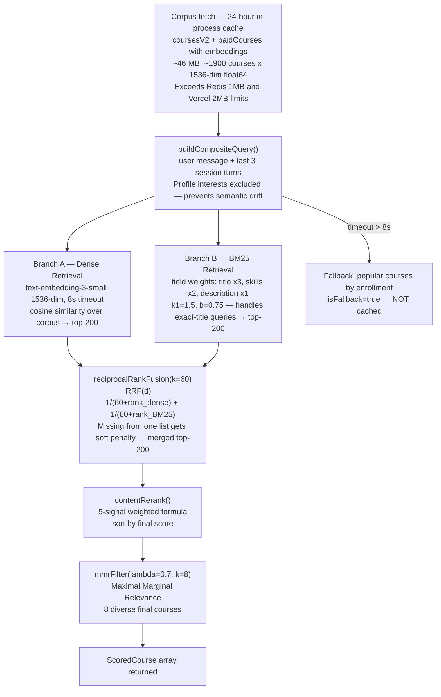
```mermaid
flowchart TD
    CORPUS["Corpus fetch — 24-hour in-process cache\ncoursesV2 + paidCourses with embeddings\n~46 MB, ~1900 courses x 1536-dim float64\nExceeds Redis 1MB and Vercel 2MB limits"] --> Q["buildCompositeQuery()\nuser message + last 3 session turns\nProfile interests excluded — prevents semantic drift"]
    Q --> C1["Branch A — Dense Retrieval\ntext-embedding-3-small 1536-dim, 8s timeout\ncosine similarity over corpus → top-200"]
    Q --> C2["Branch B — BM25 Retrieval\nfield weights: title x3, skills x2, description x1\nk1=1.5, b=0.75 — handles exact-title queries → top-200"]
    Q -->|timeout > 8s| FB["Fallback: popular courses by enrollment\nisFallback=true — NOT cached"]
    C1 --> RRF["reciprocalRankFusion(k=60)\nRRF(d) = 1/(60+rank_dense) + 1/(60+rank_BM25)\nMissing from one list gets soft penalty → merged top-200"]
    C2 --> RRF
    RRF --> RERANK["contentRerank()\n5-signal weighted formula\nsort by final score"]
    RERANK --> MMR["mmrFilter(lambda=0.7, k=8)\nMaximal Marginal Relevance\n8 diverse final courses"]
    MMR --> OUT[ScoredCourse array returned]
```

---

## F-29: Content Reranking and MMR

**Source:** `lib/courseEmbeddingSearch.ts`, `agents/rankingConfig.json`

**Step 1: Weighted Five-Signal Linear Combination.**
`contentRerank()` refines the RRF candidate pool using a weighted five-signal formula:

$$S_{\text{final}}(c) = 0.65 \cdot \text{sem}(c) + 0.10 \cdot \text{int}(c) + 0.10 \cdot \text{diff}(c) + 0.05 \cdot \text{collab}(c) - 0.10 \cdot \text{pen}(c)$$

| Signal | Weight | Description |
|--------|--------|-------------|
| `sem(c)` | 0.65 | Cosine similarity of course embedding to query embedding — dominant signal ensuring topical alignment |
| `int(c)` | 0.10 | Jaccard similarity between `course.skills` and `profile.interests`; zero for anonymous users |
| `diff(c)` | 0.10 | Difficulty match: 1.0 exact level, 0.5 for ±1 level, 0.0 for ±2 levels |
| `collab(c)` | 0.05 | Log-normalised co-enrolment collaborative filtering signal |
| `pen(c)` | −0.10 | Enrolment penalty: 1.0 if the user is already enrolled, suppressing repeat recommendations |

All weights are externalised to `agents/rankingConfig.json`, allowing the engine's bias to be tuned without modifying the core logic.

**Step 2: Maximal Marginal Relevance (MMR).**
After reranking, `mmrFilter()` applies MMR to select up to eight diverse courses. The λ = 0.7 split (70% relevance, 30% diversity) prevents near-identical courses from dominating the result list whilst keeping recommendations on-topic:

$$c^* = \arg\max_{c_i \in C \setminus S} \left[ 0.7 \cdot S_{\text{final}}(c_i) - 0.3 \cdot \max_{c_j \in S} \text{cosSim}(c_i, c_j) \right]$$

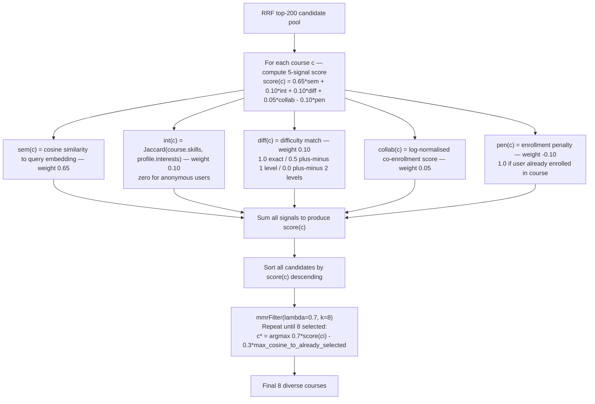
```mermaid
flowchart TD
    A["RRF top-200 candidate pool"] --> B["For each course c — compute 5-signal score\nscore(c) = 0.65*sem + 0.10*int + 0.10*diff + 0.05*collab - 0.10*pen"]
    B --> C["sem(c) = cosine similarity to query embedding — weight 0.65"]
    B --> D["int(c) = Jaccard(course.skills, profile.interests) — weight 0.10\nzero for anonymous users"]
    B --> E["diff(c) = difficulty match — weight 0.10\n1.0 exact / 0.5 plus-minus 1 level / 0.0 plus-minus 2 levels"]
    B --> F["collab(c) = log-normalised co-enrollment score — weight 0.05"]
    B --> G["pen(c) = enrollment penalty — weight -0.10\n1.0 if user already enrolled in course"]
    C --> H["Sum all signals to produce score(c)"]
    D --> H
    E --> H
    F --> H
    G --> H
    H --> I["Sort all candidates by score(c) descending"]
    I --> J["mmrFilter(lambda=0.7, k=8)\nRepeat until 8 selected:\nc* = argmax 0.7*score(ci) - 0.3*max_cosine_to_already_selected"]
    J --> K["Final 8 diverse courses"]
```

---

## F-30: Comparer Node

**Source:** `agents/chatGraph.ts`

The `ComparerNode` handles the `comparison` intent by performing dual-topic retrieval. Two concurrent recommendation queries are issued using topics extracted from `state.searchQuery` and `state.secondaryQuery` (see [F-24](#f-24-intent-classification-and-routing)).

**Cache Isolation.**
Each query uses an independent Redis cache key to prevent cross-topic collisions, ensuring that results for one subject do not overwrite or pollute the other.

**Fallback Logic.**
If the retrieval process triggers a fallback to popular courses for either topic, the comparison is aborted. This prevents the generation of redundant or misleading comparisons, as identical fallback lists would offer no analytical value.

**Output Construction.**
Consistent with the mechanism described in [F-27](#f-27-recommender-node); course cards are emitted as two labelled groups for side-by-side rendering.

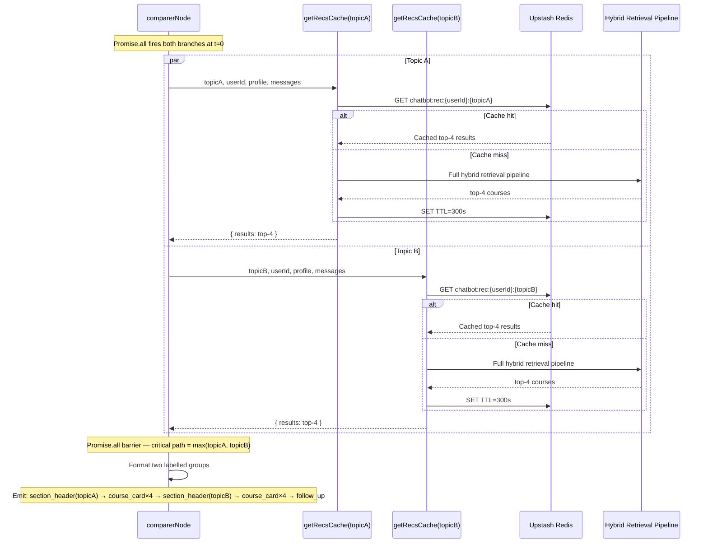
```mermaid
sequenceDiagram
    participant CMP as comparerNode
    participant RA as getRecsCache(topicA)
    participant RB as getRecsCache(topicB)
    participant RD as Upstash Redis
    participant HP as Hybrid Retrieval Pipeline

    Note over CMP: Promise.all fires both branches at t=0
    par Topic A
        CMP->>RA: topicA, userId, profile, messages
        RA->>RD: GET chatbot:rec:{userId}:{topicA}
        alt Cache hit
            RD-->>RA: Cached top-4 results
        else Cache miss
            RA->>HP: Full hybrid retrieval pipeline
            HP-->>RA: top-4 courses
            RA->>RD: SET TTL=300s
        end
        RA-->>CMP: { results: top-4 }
    and Topic B
        CMP->>RB: topicB, userId, profile, messages
        RB->>RD: GET chatbot:rec:{userId}:{topicB}
        alt Cache hit
            RD-->>RB: Cached top-4 results
        else Cache miss
            RB->>HP: Full hybrid retrieval pipeline
            HP-->>RB: top-4 courses
            RB->>RD: SET TTL=300s
        end
        RB-->>CMP: { results: top-4 }
    end
    Note over CMP: Promise.all barrier — critical path = max(topicA, topicB)
    CMP->>CMP: Format two labelled groups
    Note over CMP: Emit: section_header(topicA) → course_card×4 → section_header(topicB) → course_card×4 → follow_up
```

---

## F-31: Learning Path Node

**Source:** `agents/chatGraph.ts`

The `LearningPathNode` handles the `learning_path` intent by constructing a multi-tier educational roadmap. Three concurrent recommendation queries are issued, one per proficiency level, using level-specific query suffixes to maintain distinct Redis cache keys.

**State Manipulation.**
For each tier, the node uses a shallow copy of the `EffectiveUserProfile` with a modified `skillLevel`. This ensures that the `contentRerank()` difficulty signal targets courses at the appropriate level rather than the user's current baseline.

**Cache Isolation.**
Level-specific Redis cache keys prevent cross-tier contamination. The final path selects two optimised courses per tier for a manageable and progressive learning trajectory.

**Output Construction.**
The roadmap is assembled with tier section summaries from `STEP_SUMMARIES` and emitted using accordion-group markers for frontend rendering (see [frontend.md F-06](./frontend.md#f-06-personalised-learning-roadmap-ui)).

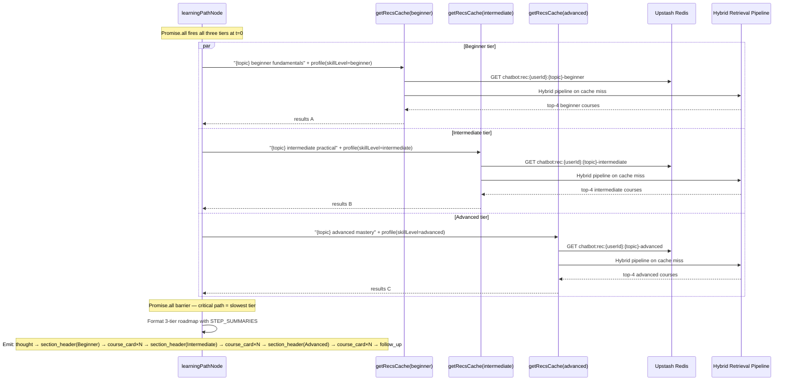
```mermaid
sequenceDiagram
    participant LPN as learningPathNode
    participant RA as getRecsCache(beginner)
    participant RB as getRecsCache(intermediate)
    participant RC as getRecsCache(advanced)
    participant RD as Upstash Redis
    participant HP as Hybrid Retrieval Pipeline

    Note over LPN: Promise.all fires all three tiers at t=0
    par Beginner tier
        LPN->>RA: "{topic} beginner fundamentals" + profile(skillLevel=beginner)
        RA->>RD: GET chatbot:rec:{userId}:{topic}-beginner
        RA->>HP: Hybrid pipeline on cache miss
        HP-->>RA: top-4 beginner courses
        RA-->>LPN: results A
    and Intermediate tier
        LPN->>RB: "{topic} intermediate practical" + profile(skillLevel=intermediate)
        RB->>RD: GET chatbot:rec:{userId}:{topic}-intermediate
        RB->>HP: Hybrid pipeline on cache miss
        HP-->>RB: top-4 intermediate courses
        RB-->>LPN: results B
    and Advanced tier
        LPN->>RC: "{topic} advanced mastery" + profile(skillLevel=advanced)
        RC->>RD: GET chatbot:rec:{userId}:{topic}-advanced
        RC->>HP: Hybrid pipeline on cache miss
        HP-->>RC: top-4 advanced courses
        RC-->>LPN: results C
    end
    Note over LPN: Promise.all barrier — critical path = slowest tier
    LPN->>LPN: Format 3-tier roadmap with STEP_SUMMARIES
    Note over LPN: Emit: thought → section_header(Beginner) → course_card×N → section_header(Intermediate) → course_card×N → section_header(Advanced) → course_card×N → follow_up
```

---

## F-32: User Profiling Pipeline: Observer and Auditor

**Source:** `agents/userProfilingAgent.ts`, `agents/profileObserverAgent.ts`, `agents/profileAuditorAgent.ts`, `lib/userProfileService.ts`, `lib/enrollmentProfilingService.ts`

The profiling pipeline runs off the critical request path via `waitUntil(analyseAndProfileUser(...))`, where `analyseAndProfileUser` is exported from `agents/userProfilingAgent.ts`. This orchestrator invokes the Observer and Auditor sub-agents in sequence and then writes the updated profile to Firestore. The pipeline contributes zero latency to time-to-first-token and executes only when `graphSucceeded === true`, preventing profiling of fallback or safety-blocked responses.

**Signal Gate.**
The pipeline is execution-gated at two levels. First, it triggers only on successful `StateGraph` completion. Second, a signal gate within `analyseAndProfileUser()` skips the pipeline on low-signal turns: turns shorter than 30 characters are skipped, and otherwise the last three user messages are checked against 14 learning-signal regex patterns (`want to learn`, `interested in`, `studying`, `working on`, etc.). A `[COURSE_CARD]` in the response always triggers profiling.

**Stage 1: Observer.**
`profileObserverAgent.ts` uses a `gpt-4o-mini` instance with `withStructuredOutput` to extract all learning signals from the conversation log. Each signal carries `topic`, `confidence` (high/medium/low), `type` (explicit/implicit/negative/contextual) and `sourceMessageIndex`. All signals, including negative ones, are forwarded to the Auditor. If every extracted signal is negative, the pipeline exits before the Auditor is called.

**Stage 2: Auditor.**
`profileAuditorAgent.ts` reconciles the raw signals against the existing user profile. It deduplicates, validates topic legitimacy, maps topics to standardised canonical labels, infers a Bloom's Taxonomy cognitive level from conversational evidence, and excludes negative-type signals from `inferredInterests`.

**Stage 3: Profile Update.**
`createNewAIProfileData()` applies exponential decay to existing interest weights before merging new ones:

$$w_i(t) = w_i(t_0) \cdot 2^{-\Delta t / \tau_{1/2}}$$

The half-life is τ½ = 30 days (`decayHalfLifeDays`). Interests with a decayed weight below 0.1 (`cullThreshold`) are silently pruned. New or reinforced interests are reset to weight 1.0. The Auditor's reasoning trace is stored in `lastReasoningTrace` for explainability before the updated profile is persisted to Firestore via a merge write.

`lib/enrollmentProfilingService.ts` also populates `enrolledCourseIds` in the `EffectiveUserProfile` from `users/{uid}.courses`, used exclusively as an enrolment penalty in `contentRerank()` to suppress courses the user has already started.

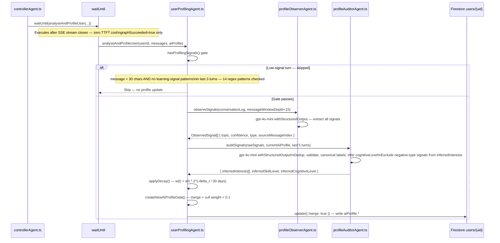
```mermaid
sequenceDiagram
    participant CA as controllerAgent.ts
    participant WU as waitUntil
    participant UPA as userProfilingAgent.ts
    participant OBS as profileObserverAgent.ts
    participant AUD as profileAuditorAgent.ts
    participant FS as Firestore users/{uid}

    CA->>WU: waitUntil(analyseAndProfileUser(...))
    Note over WU: Executes after SSE stream closes — zero TTFT cost\ngraphSucceeded=true only
    WU->>UPA: analyseAndProfileUser(userId, messages, aiProfile)
    UPA->>UPA: hasProfilingSignals() gate
    alt Low-signal turn — skipped
        Note over UPA: message < 30 chars AND no learning-signal patterns\nin last 3 turns — 14 regex patterns checked
        UPA-->>WU: Skip — no profile update
    else Gate passes
        UPA->>OBS: observeSignals(conversationLog, messageWindowDepth=15)
        OBS->>OBS: gpt-4o-mini withStructuredOutput — extract all signals
        OBS-->>UPA: ObservedSignal[] { topic, confidence, type, sourceMessageIndex }
        UPA->>AUD: auditSignals(rawSignals, currentAiProfile, last 5 turns)
        AUD->>AUD: gpt-4o-mini withStructuredOutput\nDedup, validate, canonical labels, infer cognitiveLevel\nExclude negative-type signals from inferredInterests
        AUD-->>UPA: { inferredInterests[], inferredSkillLevel, inferredCognitiveLevel }
        UPA->>UPA: applyDecay() — w(t) = w0 * 2^(-delta_t / 30 days)
        UPA->>UPA: createNewAIProfileData() — merge + cull weight < 0.1
        UPA->>FS: update({ merge: true }) — write aiProfile.*
    end
```

---

## F-33: Context Window Management

**Source:** `agents/controllerAgent.ts`, `agents/pipelineConfig.json`

Each backend component requiring LLM reasoning operates on a bounded slice of the conversation history, as configured in `pipelineConfig.json`. These context windows are intentionally asymmetric, allowing each component to access only the depth necessary for its specific role.

| Component | Config Key | Depth | Rationale |
|-----------|-----------|-------|-----------|
| Intent Classifier | `classifierHistoryDepth` | 5 | Shallow window sufficient for intent disambiguation; avoids stale context biasing classification |
| Controller Node | `controllerHistoryDepth` | 9 | Moderate window preserves multi-turn coherence for `faq` and general responses |
| Profiling Chat Log | `chatLogDepth` | 10 | Window passed to the Observer agent for raw signal extraction from recent dialogue |
| Profiling Signal Gate | `recentUserMessageCount` | 3 | Heuristic gate: the profiling pipeline is skipped unless at least one of the three most recent user messages contains a qualifying signal |
| Profiling Pipeline | `messageWindowDepth` | 15 | Wide window passed to `analyseAndProfileUser()` to maximise learning signal coverage |

*No Mermaid diagram — this feature defines configuration values used across multiple nodes.*

---

## F-34: Firestore Schema and Data Modelling

**Source:** `lib/firebaseAdmin.ts`, `agents/pipelineConfig.json`

The Firestore collections accessed by the chatbot pipeline are documented in [architecture.md §4](./architecture.md#4-data-modelling). Key implementation constraints:

**Merge Writes.**
All profile writes use `{ merge: true }` to preserve fields not managed by the profiling pipeline. Course embedding writes are scoped to the `embedding` field only via `db.collection(...).doc(id).update({ embedding })`, minimising write amplification.

**Idempotency.**
The `chatFeedback` endpoint performs an idempotency read on `(userId, messageId)` before appending a new feedback document, preventing duplicate ratings from double-submit.

**Read Isolation.**
The pipeline reads the `verifiedUserId` token once at the API boundary and propagates it downstream. The user ID is never re-read from the request body, eliminating identity-confusion vulnerabilities.

*No Mermaid diagram — schema detail is in [architecture.md §4](./architecture.md#4-data-modelling).*

---

## F-35: Three-Tier Caching Layer

**Source:** `lib/redis.ts`, `lib/courseEmbeddingSearch.ts`, `agents/pipelineConfig.json`

The architecture employs a three-tier caching strategy to accommodate diverse data types and ensure consistency across stateless serverless instances. The 46 MB embedding dataset exceeds both the 1 MB per-value limit of Upstash Redis and the 2 MB threshold of Vercel Data Cache, necessitating in-process caching for that tier.

| Caching Tier | Mechanism | Cached Data | TTL |
|-------------|-----------|------------|-----|
| External Shared | Upstash Redis | Platform FAQ documentation; user-specific recommendation results; rate-limiting counters; circuit breaker failure counts and expiration timestamps | 60 s – 1 h |
| CDN / Edge | Vercel Data Cache (`unstable_cache`) | Top-500 free courses by enrolment (~100 KB payload) | 24 h |
| In-process | Module-level variable | Course embedding corpus (~46 MB); derived BM25 index; compiled `StateGraph` and LLM client singletons | 24 h |

**Eventual Consistency.**
Fallback results are intentionally excluded from caching. Transient retrieval failures do not persist: subsequent requests are forced to re-execute the full embedding and vector-search routine, prioritising eventual consistency over computational overhead reduction.

**Fail-Open Policy.**
All Redis-dependent features fail open. If the Upstash instance becomes unreachable, the system bypasses the cache layer and initiates direct Firestore reads, preventing a total service outage at the cost of a marginal increase in retrieval latency.

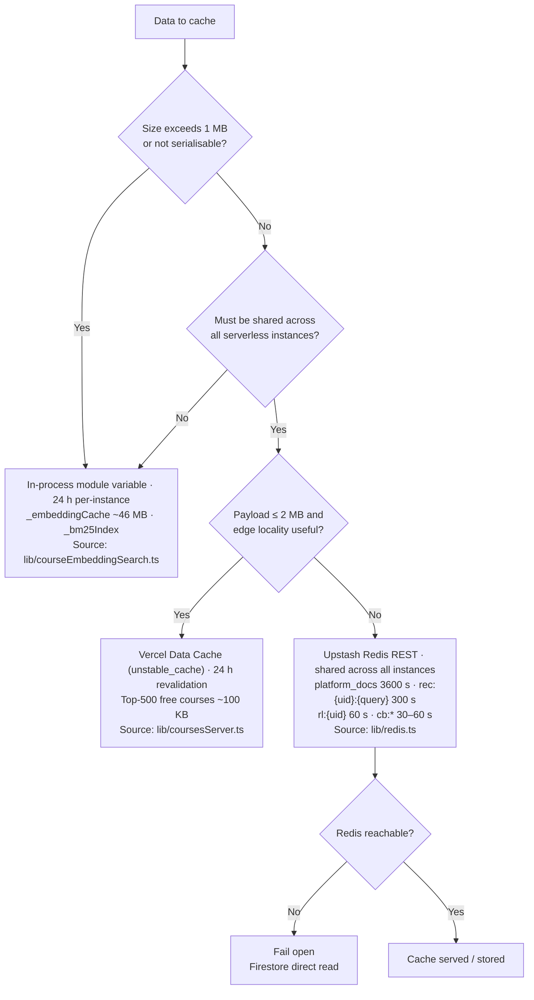
```mermaid
flowchart TD
    A[Data to cache] --> B{Size exceeds 1 MB<br/>or not serialisable?}
    B -- Yes --> C["In-process module variable · 24 h per-instance<br/>_embeddingCache ~46 MB · _bm25Index<br/>Source: lib/courseEmbeddingSearch.ts"]
    B -- No --> D{Must be shared across<br/>all serverless instances?}
    D -- No --> C
    D -- Yes --> E{Payload ≤ 2 MB and<br/>edge locality useful?}
    E -- Yes --> F["Vercel Data Cache (unstable_cache) · 24 h revalidation<br/>Top-500 free courses ~100 KB<br/>Source: lib/coursesServer.ts"]
    E -- No --> G["Upstash Redis REST · shared across all instances<br/>platform_docs 3600 s · rec:{uid}:{query} 300 s<br/>rl:{uid} 60 s · cb:* 30–60 s<br/>Source: lib/redis.ts"]
    G --> H{Redis reachable?}
    H -- No --> I[Fail open<br/>Firestore direct read]
    H -- Yes --> J[Cache served / stored]
```

---

## F-36: Rate Limiter

**Source:** `lib/rateLimiter.ts`, `agents/pipelineConfig.json`

`lib/rateLimiter.ts` implements a Redis-backed fixed-window rate limiter. The window expiry is set with `EXPIRE` only on `count === 1`, fixing the window boundary at the first request and avoiding the extra state reads required by sliding-window and token-bucket algorithms.

Rate limit checks run after token verification but before body parsing, ensuring the key is derived from the verified Firebase UID. This prevents authenticated clients from bypassing limits by supplying a fake ID in the request body.

| User Category | Request Quota | Rationale |
|--------------|--------------|-----------|
| Authenticated | 20 per minute | Supports normal interactive usage for registered users |
| Unauthenticated | 5 per minute | Mitigates automated abuse and resource exhaustion by anonymous clients |

The limiter fails open when Redis is unavailable, prioritising service availability over strict enforcement during transient infrastructure outages.

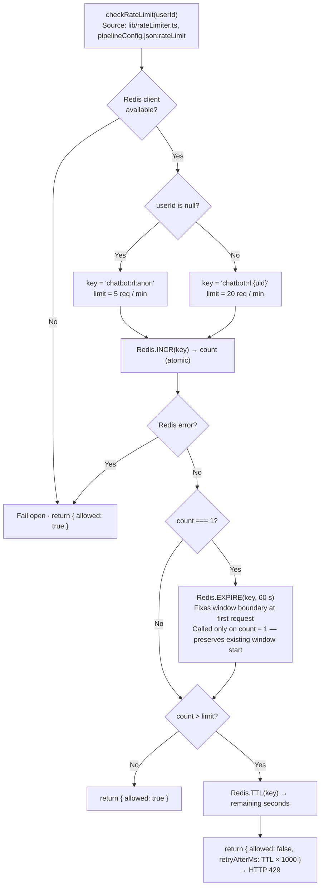
```mermaid
flowchart TD
    A["checkRateLimit(userId)<br/>Source: lib/rateLimiter.ts, pipelineConfig.json:rateLimit"] --> B{Redis client<br/>available?}
    B -- No --> C["Fail open · return { allowed: true }"]
    B -- Yes --> D{userId is null?}
    D -- Yes --> E["key = 'chatbot:rl:anon'<br/>limit = 5 req / min"]
    D -- No --> F["key = 'chatbot:rl:{uid}'<br/>limit = 20 req / min"]
    E --> G["Redis.INCR(key) → count (atomic)"]
    F --> G
    G --> H{Redis error?}
    H -- Yes --> C
    H -- No --> I{count === 1?}
    I -- Yes --> J["Redis.EXPIRE(key, 60 s)<br/>Fixes window boundary at first request<br/>Called only on count = 1 — preserves existing window start"]
    I -- No --> K{count > limit?}
    J --> K
    K -- No --> L["return { allowed: true }"]
    K -- Yes --> M["Redis.TTL(key) → remaining seconds"]
    M --> N["return { allowed: false, retryAfterMs: TTL × 1000 }<br/>→ HTTP 429"]
```

---

## F-37: Circuit Breaker

**Source:** `lib/circuitBreaker.ts`, `agents/pipelineConfig.json`

`lib/circuitBreaker.ts` implements a Redis-backed circuit breaker protecting exclusively against OpenAI API outages. The breaker has two states:

| State | Transition Trigger | Behaviour |
|-------|-------------------|-----------|
| **CLOSED** (normal) | ≥ 5 OpenAI failures within a 30-second fixed window | Normal operation. When the trigger is met, an `open_until` key is written to Redis with a 60-second TTL and the breaker transitions to OPEN. |
| **OPEN** (fallback) | Expiration of the 60-second `open_until` TTL | All LLM calls are bypassed and a pre-built fallback response is served immediately. Auto-resets to CLOSED on TTL expiry. `recordSuccess()` clears the failure counter only; it does not force-close the circuit. |

The breaker distinguishes LLM errors from Firestore errors (`FirebaseError` does not trip the circuit) and HTTP 429 responses (rate-limiting is not an outage). If Upstash Redis is unavailable, the circuit breaker falls back to per-instance in-process state, retaining the ability to protect each instance independently.

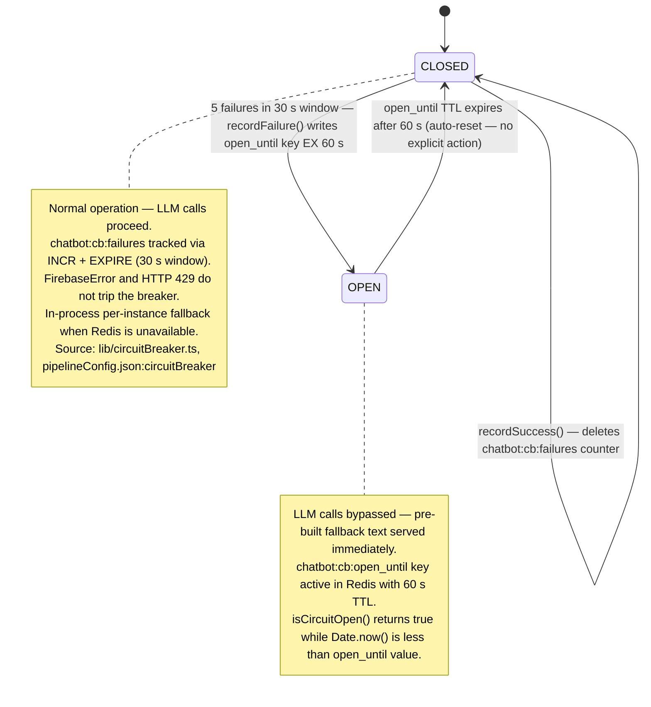
```mermaid
stateDiagram-v2
    [*] --> CLOSED

    CLOSED --> OPEN : 5 failures in 30 s window — recordFailure() writes open_until key EX 60 s
    OPEN --> CLOSED : open_until TTL expires after 60 s (auto-reset — no explicit action)
    CLOSED --> CLOSED : recordSuccess() — deletes chatbot:cb:failures counter

    note right of CLOSED
        Normal operation — LLM calls proceed.
        chatbot:cb:failures tracked via INCR + EXPIRE (30 s window).
        FirebaseError and HTTP 429 do not trip the breaker.
        In-process per-instance fallback when Redis is unavailable.
        Source: lib/circuitBreaker.ts, pipelineConfig.json:circuitBreaker
    end note

    note right of OPEN
        LLM calls bypassed — pre-built fallback text served immediately.
        chatbot:cb:open_until key active in Redis with 60 s TTL.
        isCircuitOpen() returns true while Date.now() is less than open_until value.
    end note
```

---

## F-38: Graceful Degradation

**Source:** `agents/controllerAgent.ts`, `agents/inputGuardAgent.ts`, `agents/outputGuardAgent.ts`, `lib/courseEmbeddingSearch.ts`

The system implements graceful degradation at every external dependency boundary. In all cases, the degraded path avoids returning an HTTP error to the client, maintaining high system availability.

| Component | Failure Type | Degraded Operational State |
|-----------|-------------|---------------------------|
| OpenAI API | Critical path interruption | Circuit breaker trips to OPEN; pre-built popular-course fallback response served immediately |
| Upstash Redis | Shared state latency / outage | Fail-open: reverts to direct Firestore reads; rate limiting suspended; circuit breaker degrades to per-instance in-process state |
| Embedding pipeline | Retrieval failure | Popular courses by enrolment served; flagged `isFallback=true` to prevent caching |
| Input Guard (Layer 4) | LLM safety layer failure | Fails open; Layers 1 and 2 rule engine result used as fallback |
| Output Guard (Layer 4) | LLM policy check failure | Reverts to Layers 1 and 2 at conservative `outputFallbackThreshold`; additionally requires moderation API clear |
| Platform Knowledge tool | Tool-call exception | LangChain catches the exception; `ControllerNode` responds from parametric knowledge without retrieved context |

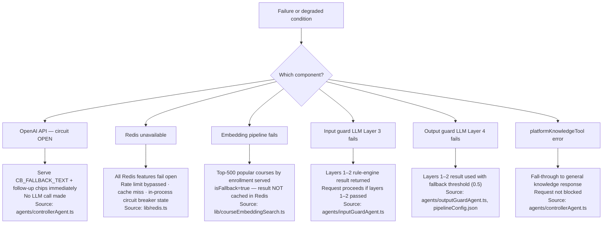
```mermaid
flowchart TD
    A[Failure or degraded condition] --> B{Which component?}
    B --> C[OpenAI API — circuit OPEN]
    B --> D[Redis unavailable]
    B --> E[Embedding pipeline fails]
    B --> F[Input guard LLM Layer 3 fails]
    B --> G[Output guard LLM Layer 4 fails]
    B --> H[platformKnowledgeTool error]
    C --> C1["Serve CB_FALLBACK_TEXT + follow-up chips immediately<br/>No LLM call made<br/>Source: agents/controllerAgent.ts"]
    D --> D1["All Redis features fail open<br/>Rate limit bypassed · cache miss · in-process circuit breaker state<br/>Source: lib/redis.ts"]
    E --> E1["Top-500 popular courses by enrollment served<br/>isFallback=true — result NOT cached in Redis<br/>Source: lib/courseEmbeddingSearch.ts"]
    F --> F1["Layers 1–2 rule-engine result returned<br/>Request proceeds if layers 1–2 passed<br/>Source: agents/inputGuardAgent.ts"]
    G --> G1["Layers 1–2 result used with fallback threshold (0.5)<br/>Source: agents/outputGuardAgent.ts, pipelineConfig.json"]
    H --> H1["Fall-through to general knowledge response<br/>Request not blocked<br/>Source: agents/controllerAgent.ts"]
```

---

## F-39: Traceability and Observability

**Source:** `lib/logger.ts`, `app/api/chat/route.ts`, `agents/controllerAgent.ts`

**Structured Logging.**
`lib/logger.ts` emits structured JSON logs at every node boundary. A `requestId` UUID generated per request in `app/api/chat/route.ts` is included in every log entry, enabling cross-node log correlation in Vercel's log aggregation environment.

| Property | Type | Description |
|----------|------|-------------|
| `ts` | string | ISO-8601 timestamp |
| `level` | string | Severity: `info`, `warn` or `error` |
| `requestId` | string | Unique UUID generated per request |
| `userId` | string | Authenticated Firebase UID |
| `node` | string | The LangGraph node or module emitting the log |
| `intent` | string | Classified user intent |
| `latencyMs` | number | Execution duration in milliseconds |
| `isValid` | boolean | Validation status from `InputGuardNode` |
| `isSafe` | boolean | Safety status from `OutputGuardNode` |
| `message` | string | Human-readable description of the event |
| `error` | string | Stringified error trace for debugging |

**LLM Observability.**
When `LANGCHAIN_TRACING_V2=true`, LangSmith distributed tracing captures every LangGraph node invocation, LLM transaction and tool execution as a named span. This serves as the primary instrument for latency profiling, bottleneck identification and safety review of agentic decision-making.

**Reasoning Transparency.**
The `thought` SSE event makes the pipeline's reasoning visible to end users through the Agent Collaboration Log UI component. Each recommendation response includes a deterministic synthetic thought block with `[CLASSIFIER]`, `[RESEARCHER]`, `[CURATOR]` and `[SAFETY]` tags describing what data drove the result. See also [frontend.md F-19](./frontend.md#f-19-reasoning-trace-popover).

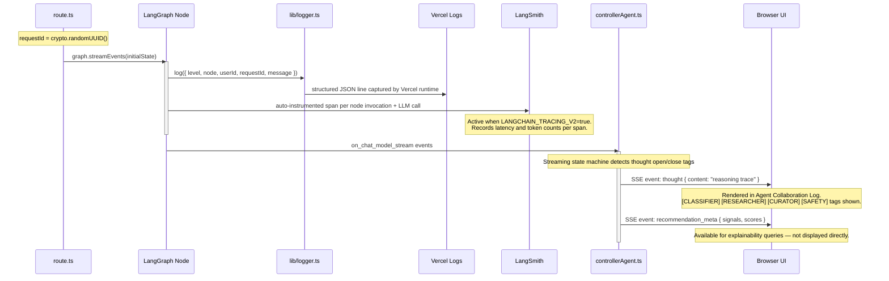
```mermaid
sequenceDiagram
    participant Route as route.ts
    participant Node as LangGraph Node
    participant Logger as lib/logger.ts
    participant Vercel as Vercel Logs
    participant LangSmith as LangSmith
    participant Controller as controllerAgent.ts
    participant Client as Browser UI

    Note over Route: requestId = crypto.randomUUID()
    Route->>Node: graph.streamEvents(initialState)
    activate Node
    Node->>Logger: log({ level, node, userId, requestId, message })
    Logger->>Vercel: structured JSON line captured by Vercel runtime
    Node->>LangSmith: auto-instrumented span per node invocation + LLM call
    Note over LangSmith: Active when LANGCHAIN_TRACING_V2=true.<br/>Records latency and token counts per span.
    deactivate Node
    Node->>Controller: on_chat_model_stream events
    activate Controller
    Note over Controller: Streaming state machine detects thought open/close tags
    Controller->>Client: SSE event: thought { content: "reasoning trace" }
    Note over Client: Rendered in Agent Collaboration Log.<br/>[CLASSIFIER] [RESEARCHER] [CURATOR] [SAFETY] tags shown.
    Controller->>Client: SSE event: recommendation_meta { signals, scores }
    Note over Client: Available for explainability queries — not displayed directly.
    deactivate Controller
```

---

## F-40: Communication Protocols: SSE and JSON Leak Filter

**Source:** `app/api/chat/route.ts`, `agents/controllerAgent.ts`

Server-Sent Events over HTTP/1.1 is the streaming transport. SSE is unidirectional (server to client) and natively supported by browsers without additional infrastructure. The client uses a `fetch`-based stream reader rather than the browser's `EventSource` API, providing finer control over the stream lifecycle including abort support for stop-generation and error detection via the absence of a `done` frame.

The headers `Content-Type: text/event-stream; charset=utf-8`, `Cache-Control: no-cache` and `X-Accel-Buffering: no` are set to prevent reverse proxy and CDN layers from buffering SSE frames before delivery.

**SSE Event Types.**

| Event | Description |
|-------|-------------|
| `token` | Natural language text chunk |
| `thought` | Reasoning trace extracted from `<thought>…</thought>` blocks |
| `course_card` | Structured course object for recommendation cards |
| `follow_up` | Suggested follow-up questions |
| `recommendation_meta` | Scoring metadata |
| `block` | Safety block (stream terminates) |
| `hallucination_warning` | High-risk output flag (stream continues) |
| `done` | Stream complete sentinel |

**JSON Leak Filter.**
The stream parser includes a rolling brace-depth tracker that detects and discards complete JSON objects matching the classifier output pattern (`{"intent":...,"searchQuery":...}`) at the start of the stream. A 10 KB hard cap prevents unbounded buffer growth. This filter operates as a belt-and-suspenders defence: the structural fix is that `classifyIntent()` runs outside `graph.streamEvents()` (see [F-21](#f-21-speculative-parallel-pre-execution)).

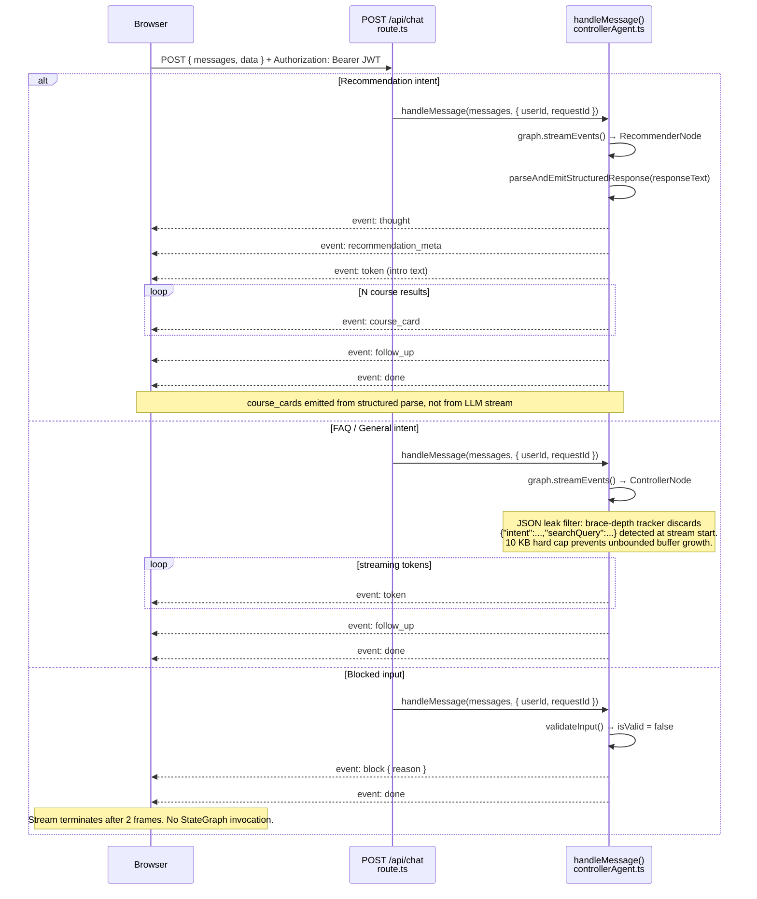
```mermaid
sequenceDiagram
    participant Browser
    participant Route as POST /api/chat<br/>route.ts
    participant Handle as handleMessage()<br/>controllerAgent.ts

    Browser->>Route: POST { messages, data } + Authorization: Bearer JWT

    alt Recommendation intent
        Route->>Handle: handleMessage(messages, { userId, requestId })
        Handle->>Handle: graph.streamEvents() → RecommenderNode
        Handle->>Handle: parseAndEmitStructuredResponse(responseText)
        Handle-->>Browser: event: thought
        Handle-->>Browser: event: recommendation_meta
        Handle-->>Browser: event: token (intro text)
        loop N course results
            Handle-->>Browser: event: course_card
        end
        Handle-->>Browser: event: follow_up
        Handle-->>Browser: event: done
        Note over Handle,Browser: course_cards emitted from structured parse, not from LLM stream
    else FAQ / General intent
        Route->>Handle: handleMessage(messages, { userId, requestId })
        Handle->>Handle: graph.streamEvents() → ControllerNode
        Note over Handle: JSON leak filter: brace-depth tracker discards<br/>{"intent":...,"searchQuery":...} detected at stream start.<br/>10 KB hard cap prevents unbounded buffer growth.
        loop streaming tokens
            Handle-->>Browser: event: token
        end
        Handle-->>Browser: event: follow_up
        Handle-->>Browser: event: done
    else Blocked input
        Route->>Handle: handleMessage(messages, { userId, requestId })
        Handle->>Handle: validateInput() → isValid = false
        Handle-->>Browser: event: block { reason }
        Handle-->>Browser: event: done
        Note over Browser: Stream terminates after 2 frames. No StateGraph invocation.
    end
```

---

## F-41: State and Session Management

**Source:** `agents/controllerAgent.ts`, `components/chatbot_components/Chatbot.tsx`

**Server-Side Streaming State Machine.**
Within `handleMessage()`, boolean flags (`inThought`, `inFollowUp`) and rolling buffers (`pendingBuffer`, `thoughtBuffer`, `followUpBuffer`) implement a state machine that processes the LLM's raw token stream. The `longestTagPrefix()` helper holds back trailing bytes that could be the beginning of a watched tag (`<thought>`, `[FOLLOW_UP]:`), ensuring tags split across chunk boundaries are never partially emitted as visible user-facing text.

**Message History Truncation.**
Context windows are bounded per component: the Controller Node uses the last 9 turns (`controllerHistoryDepth`), the intent classifier uses the last 5 turns (`classifierHistoryDepth`) and the profiling pipeline uses the last 15 turns (`messageWindowDepth`). These bounds prevent token budget exhaustion in long conversations whilst preserving enough context for coherent multi-turn responses.

For client-side session persistence, see [frontend.md F-09](./frontend.md#f-09-session-persistence).

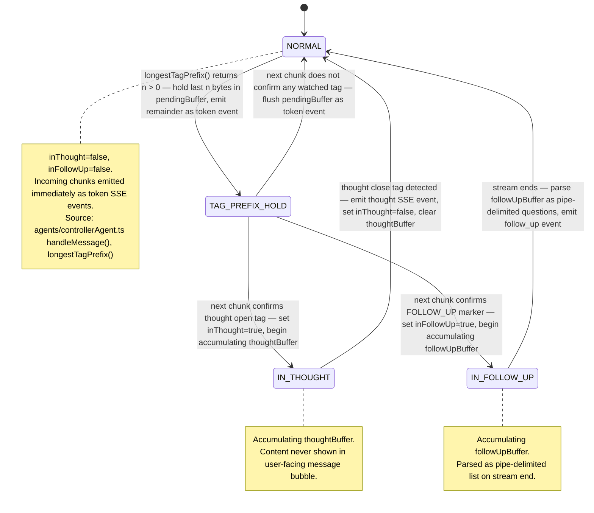
```mermaid
stateDiagram-v2
    [*] --> NORMAL

    NORMAL --> TAG_PREFIX_HOLD : longestTagPrefix() returns n > 0 — hold last n bytes in pendingBuffer, emit remainder as token event
    TAG_PREFIX_HOLD --> NORMAL : next chunk does not confirm any watched tag — flush pendingBuffer as token event
    TAG_PREFIX_HOLD --> IN_THOUGHT : next chunk confirms thought open tag — set inThought=true, begin accumulating thoughtBuffer
    TAG_PREFIX_HOLD --> IN_FOLLOW_UP : next chunk confirms FOLLOW_UP marker — set inFollowUp=true, begin accumulating followUpBuffer
    IN_THOUGHT --> NORMAL : thought close tag detected — emit thought SSE event, set inThought=false, clear thoughtBuffer
    IN_FOLLOW_UP --> NORMAL : stream ends — parse followUpBuffer as pipe-delimited questions, emit follow_up event

    note right of NORMAL
        inThought=false, inFollowUp=false.
        Incoming chunks emitted immediately as token SSE events.
        Source: agents/controllerAgent.ts handleMessage(), longestTagPrefix()
    end note

    note right of IN_THOUGHT
        Accumulating thoughtBuffer.
        Content never shown in user-facing message bubble.
    end note

    note right of IN_FOLLOW_UP
        Accumulating followUpBuffer.
        Parsed as pipe-delimited list on stream end.
    end note
```

---

## F-42: Security and Identity

**Source:** `app/api/chat/route.ts`, `lib/firebaseAdmin.ts`

The API route extracts the `Authorization: Bearer <token>` header and verifies the Firebase ID token via `adminAuth.verifyIdToken()`. The decoded Firebase UID becomes `verifiedUserId`, the single trusted source of identity for the entire request. It is used for the rate limit key, recommendation cache key, profile lookup and profile write-back. The user identity is never re-read from the request body.

**Privilege Access Control.**
The system separates access control into two independent layers:

| Layer | Behaviour |
|-------|-----------|
| API | `POST /api/chat` permits unauthenticated requests. Anonymous users may submit chat messages but are subject to stricter rate limits. Personalisation and profile persistence are disabled for unauthenticated users. |
| UI | The chatbot trigger button (`ChatbotShell.tsx`) is not rendered for unauthenticated visitors. |

Invalid or expired tokens are rejected with HTTP 401 before any pipeline logic executes. Unauthenticated requests proceed with `verifiedUserId = null` and are handled as anonymous sessions downstream.

```mermaid
sequenceDiagram
    participant Client as Client (Browser)
    participant FirebaseAuth as Firebase Auth
    participant Route as POST /api/chat<br/>route.ts
    participant AdminSDK as Firebase Admin SDK<br/>lib/firebaseAdmin.ts
    participant Pipeline as Pipeline Downstream

    Client->>FirebaseAuth: auth.currentUser.getIdToken()
    FirebaseAuth-->>Client: signed Firebase ID token (JWT, ~1 h expiry)
    Client->>Route: POST { messages, data }<br/>Authorization: Bearer JWT

    Route->>AdminSDK: adminAuth.verifyIdToken(token)

    alt Valid token
        AdminSDK-->>Route: DecodedIdToken { uid: verifiedUserId }
        par Rate limit key
            Route->>Pipeline: checkRateLimit(verifiedUserId) — chatbot:rl:{uid}
        and Profile lookup
            Route->>Pipeline: buildEffectiveUserProfile(verifiedUserId) — Firestore users/{uid}
        and Recommendation cache key
            Route->>Pipeline: cache key chatbot:rec:{verifiedUserId}:{query}
        and Profiling write-back
            Route->>Pipeline: analyseAndProfileUser(verifiedUserId, ...) — waitUntil
        end
        Note over Route,Pipeline: verifiedUserId from decoded.uid — never re-read from request body.
    else Invalid or expired token
        AdminSDK-->>Route: throws error
        Route-->>Client: HTTP 401 Unauthorized — no pipeline logic executes
    end
```

---

## F-43: Post-Processing and Persistence

**Source:** `agents/controllerAgent.ts`, `app/api/chat/feedback/route.ts`

**Post-Stream Structured Response Parsing.**
After the LangGraph `streamEvents()` loop completes, `parseAndEmitStructuredResponse()` processes the `responseText` from specialist nodes into typed SSE events. The parse order ensures correct client-side render ordering: thought → recommendation_meta → token (intro text) → course_card × n → follow_up. Inter-card text between course groups is emitted as `section_header` events, displayed as visual separators in comparison and learning-path responses.

**Background Profiling via `waitUntil`.**
Vercel's `waitUntil` API schedules the profiling pipeline to run after the response stream is closed, removing all profiling latency from the critical path. The pipeline is invoked only when `graphSucceeded === true`; profiling errors are caught and logged without affecting the completed user response.

**Feedback Persistence.**
`POST /api/chat/feedback` persists thumbs-up/down ratings to the `chatFeedback` Firestore collection. The endpoint is idempotent per `(userId, messageId)` pair: an idempotency read is performed before appending a new document.

```mermaid
sequenceDiagram
    participant Graph as graph.streamEvents()
    participant Handler as handleMessage()<br/>controllerAgent.ts
    participant Parse as parseAndEmitStructuredResponse()
    participant Client as Browser (SSE stream)
    participant WaitUntil as waitUntil()
    participant Profiling as analyseAndProfileUser()
    participant Firestore

    Graph-->>Handler: streamEvents() loop complete — finalGraphState captured

    alt Structured intent (recommendation / comparison / learning_path)
        Handler->>Parse: parseAndEmitStructuredResponse(responseText, controller)
        Parse-->>Client: event: thought
        Parse-->>Client: event: recommendation_meta
        Parse-->>Client: event: token (intro text)
        loop N course cards
            Parse-->>Client: event: course_card
        end
        Parse-->>Client: event: follow_up
        Parse-->>Handler: returns introText for profiling
    end

    Handler-->>Client: event: done
    Handler->>Handler: controller.close() — response stream closed

    Note over Handler,WaitUntil: graphSucceeded === true
    Handler->>WaitUntil: waitUntil(analyseAndProfileUser(userId, last-N messages))
    Note over WaitUntil: Runs after response delivered — zero latency on critical path
    WaitUntil->>Profiling: analyseAndProfileUser(userId, messages)
    Profiling->>Firestore: users/{uid} merge write — aiProfile.inferredInterests, interestWeights
    Profiling-->>WaitUntil: complete (errors caught and logged)
```

---

## F-44: Deployment Infrastructure

**Source:** `app/api/chat/route.ts`, `package.json`, `scripts/write-firebase-key.cjs`

The system is deployed on Vercel as a Next.js 14 application. All API routes are deployed as serverless functions with no persistent runtime state between invocations. Each request is handled in an isolated, stateless invocation, eliminating shared mutable state problems and tight-coupling deployment constraints.

**Environment Variables.**

| Variable | Purpose |
|----------|---------|
| `NEXT_PUBLIC_FIREBASE_*` | Firebase client SDK configuration |
| `FIREBASE_PROJECT_ID`, `FIREBASE_CLIENT_EMAIL`, `FIREBASE_PRIVATE_KEY` | Firebase Admin SDK credentials |
| `OPENAI_API_KEY` | OpenAI API (LLM inference, embeddings, moderation) |
| `UPSTASH_REDIS_REST_URL`, `UPSTASH_REDIS_REST_TOKEN` | Upstash Redis REST endpoint (optional — system degrades gracefully without it) |
| `LANGCHAIN_TRACING_V2`, `LANGCHAIN_API_KEY`, `LANGCHAIN_ENDPOINT`, `LANGCHAIN_PROJECT` | LangSmith distributed tracing (optional — all four must be set together) |

**Pre-Build Scripts.**
The `predev` and `prebuild` npm lifecycle hooks run `scripts/write-firebase-key.cjs`, reconstructing the Firebase service account JSON from flat environment variables before the application starts. This allows the private key to be stored in Vercel's secrets model.

**One-Time Data Pipeline Scripts.**

| Script | Command | Effect |
|--------|---------|--------|
| `generate-embeddings` | `npm run generate-embeddings` | Embeds all course documents and writes 1,536-dim `embedding` arrays to Firestore |
| `migrate-faq` | `npm run migrate-faq` | Migrates FAQ Markdown documents to the `platformDocs` Firestore collection with pre-computed embeddings |
| `precompute-coenrollment` | `npm run precompute-coenrollment` | Computes collaborative filtering co-enrolment scores and writes `coEnrollmentScore` fields to all course documents |

All three scripts are idempotent and can be re-run after bulk course updates. They run manually outside the CI/CD process.

**Scalability Note.**
The in-process 24-hour embedding cache means each cold-start serverless instance fetches the full ~46 MB corpus from Firestore independently. At approximately 2,000 courses, this is an accepted trade-off. The `fetchCourseEmbeddingsFromFirestore()` and `semanticSearch()` functions in `lib/courseEmbeddingSearch.ts` are designed to be replaced by a dedicated vector database client call without changing any downstream pipeline code.

```mermaid
flowchart TD
    A[handleMessage called] --> B{Circuit breaker OPEN?}
    B -- Yes --> Z[Serve fallback immediately]
    B -- No --> C[Three optimisations applied]

    subgraph OPT1["① Recommendation Cache — lib/redis.ts"]
        direction TB
        D[getRecommendationsWithCache] --> E{"Redis hit?<br/>chatbot:rec:{uid}:{query} TTL 300 s"}
        E -- Hit --> F["Return cached ScoredCourse[]<br/>Skip embedding pipeline entirely"]
        E -- Miss --> G["Run full pipeline<br/>Store result in Redis<br/>isFallback=true results NOT cached"]
    end

    subgraph OPT2["② Speculative Pre-execution — agents/controllerAgent.ts"]
        direction TB
        H["Promise.all([<br/>  buildEffectiveUserProfile(),<br/>  validateInput(),<br/>  classifyIntent()<br/>])"] --> I["All three resolve in parallel<br/>Eliminates cumulative sequential I/O latency"]
    end

    subgraph OPT3["③ Singleton LLM Clients — agents/agentSetup.ts"]
        direction TB
        J["Module-level ChatOpenAI<br/>and OpenAIEmbeddings singletons"] --> K["Re-used on every warm instance request<br/>No repeated client instantiation per call"]
    end

    C --> OPT1
    C --> OPT2
    C --> OPT3
```

---

## Referenced files

All paths are relative to `fyp_codebase/Lifelong-Learning-App/`.

| File | Description |
|------|-------------|
| `agents/controllerAgent.ts` | `handleMessage()` orchestrator, rolling SSE state machine, speculative pre-execution (F-21, F-25, F-33, F-38, F-40, F-41, F-43) |
| `app/api/chat/route.ts` | SSE stream handler: auth, rate limiting, circuit breaker, pipeline entry point (F-39, F-40, F-42, F-44) |
| `agents/chatGraph.ts` | LangGraph `StateGraph`, specialist nodes, retrieval tools, intent classifier (F-20, F-24, F-25, F-26, F-27, F-30, F-31) |
| `agents/agentSetup.ts` | Singleton `StateGraph` compilation (F-20) |
| `agents/inputGuardAgent.ts` | 4-stage input validation pipeline (F-22, F-38) |
| `agents/outputGuardAgent.ts` | 4-stage output validation pipeline (F-23, F-38) |
| `lib/courseEmbeddingSearch.ts` | Hybrid retrieval: dense cosine, BM25, RRF, 5-signal reranking, MMR (F-28, F-29, F-35, F-38) |
| `lib/userProfileService.ts` | Builds `EffectiveUserProfile`; applies 30-day half-life decay (F-21, F-32) |
| `agents/userProfilingAgent.ts` | Profiling orchestrator: invokes Observer and Auditor, writes `aiProfile` (F-32) |
| `agents/profileObserverAgent.ts` | Extracts raw learning interest signals from the conversation (F-32) |
| `agents/profileAuditorAgent.ts` | Deduplicates and validates signals; infers Bloom's cognitive level (F-32) |
| `lib/enrollmentProfilingService.ts` | Updates user profile on enrolment and completion events (F-32) |
| `lib/redis.ts` | Upstash Redis singleton: platform docs cache, recommendation cache, circuit breaker state (F-26, F-35, F-36) |
| `lib/rateLimiter.ts` | Fixed-window rate limiter (F-36) |
| `lib/circuitBreaker.ts` | Redis-backed circuit breaker for OpenAI outages (F-37) |
| `lib/logger.ts` | Structured JSON logger with per-request `requestId` (F-39) |
| `lib/firebaseAdmin.ts` | Server-side Firebase Admin SDK for Firestore and Auth (F-34, F-42) |
| `lib/coursesServer.ts` | Vercel Data Cache for top-500 free courses by enrolment, used as retrieval fallback (F-35) |
| `app/api/chat/feedback/route.ts` | Persists thumbs-up/down ratings; idempotent per `(userId, messageId)` (F-43) |
