# Frontend Feature Reference

This document covers frontend features F-01 to F-19: the chat panel, streaming UI, course presentation, session management, accessibility and safety UI components. All features are implemented primarily in `components/chatbot_components/Chatbot.tsx` unless stated otherwise.

For the system architecture overview, requirements and use case index, see [architecture.md](./architecture.md). For backend features, see [backend.md](./backend.md).

All file paths are relative to `fyp_codebase/Lifelong-Learning-App/`.

---

## Client-Side SSE Overview

**Source:** `components/chatbot_components/Chatbot.tsx`, `app/api/chat/route.ts`

The client uses a `fetch`-based `ReadableStream` reader rather than the browser's `EventSource` API, providing explicit control over the stream lifecycle including abort support and error detection via the absence of a `done` frame.

Each frame follows the format `event: <type>\ndata: <JSON>`. The client dispatches each parsed frame to a dedicated handler based on its event type.

| Event | Payload | Client Handler |
|-------|---------|---------------|
| `token` | `{ content: string }` | Appended to message content, enabling the streaming text effect |
| `thought` | `{ content: string }` | Stored on the message object; rendered in the Reasoning Trace Popover (F-19) |
| `course_card` | `{ title, vendor, imageUrl, url, difficulty, duration, isPaid, price, courseId, courseType }` | Collected in a local buffer; committed to React state only on `done` |
| `follow_up` | `{ questions: string[] }` | Rendered as clickable pill buttons beneath the message bubble (F-02) |
| `recommendation_meta` | `{ signals, skillLevel, query, scores[] }` | Stored on the message state for intent indicators and explainability |
| `section_header` | `{ content: string }` | Pushed as a separator; not rendered directly |
| `block` | `{ reason: string }` | Transitions message to blocked state; displays safety notice |
| `hallucination_warning` | `{}` | Displays a warning banner below the message bubble (F-14) |
| `done` | `{}` | Finalises the message, attaches `courseCards`, re-enables input and persists to `localStorage` |

`course_card` events are buffered and committed only on `done` to ensure that course card rendering and intent-based layout selection always operate on the complete set of results. For the server-side SSE emission pipeline and JSON leak filter, see [backend.md F-40](./backend.md#f-40-communication-protocols-sse-and-json-leak-filter).

---

## F-01: Chat Panel Layout and Panel Management

**Source:** `components/chatbot_components/ChatbotShell.tsx`, `components/chatbot_components/Chatbot.tsx`

The chat panel is implemented as a resizeable sliding panel anchored to the right edge of the viewport. It renders over the existing page backdrop, keeping the underlying content visible. Opening the panel shifts the page body by the current panel width (`body.style.marginRight = \`${width}px\``) to prevent content overlap. The panel defaults to 400 px and is user-resizable via a drag handle on the left edge. The margin is restored on close.

Open/close state is managed by `ChatbotShell.tsx`. The trigger is a floating action button (`ChatbotButton.tsx`) at the bottom-right corner of the viewport. The chatbot trigger button is not rendered for unauthenticated visitors. Focus is trapped within the chat panel via Radix UI's `FocusScope` when open, and returned to the trigger button on close (WCAG 2.4.3).

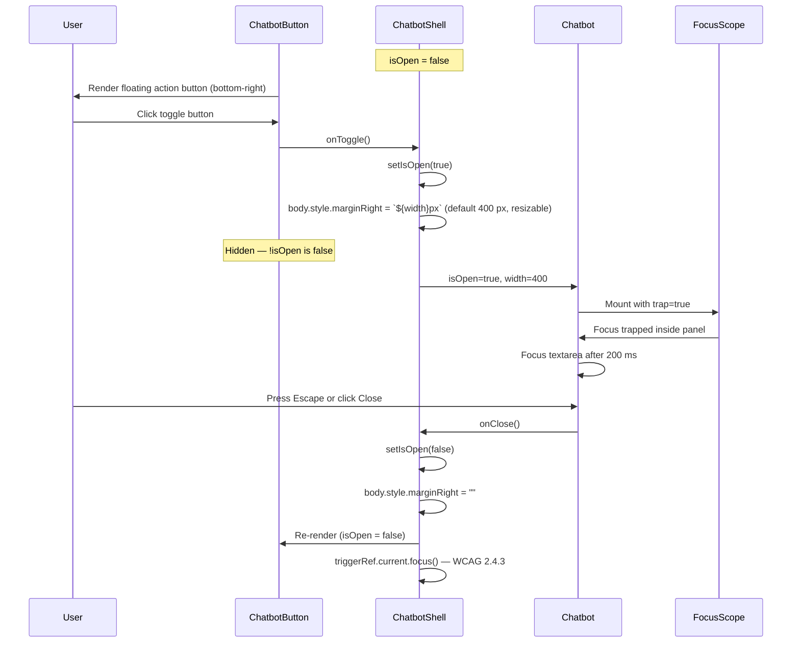

---

## F-02: Follow-up Question Pills

**Source:** `components/chatbot_components/Chatbot.tsx`

After each assistant response, the `follow_up` SSE event delivers up to three contextual suggestions rendered as pill buttons below the message bubble. The active chip set adapts to the last-detected response intent (`recommendation`, `faq` or `general`), keeping suggestions relevant to the current conversation state. Clicking a pill injects the question text directly into the input field and submits it.

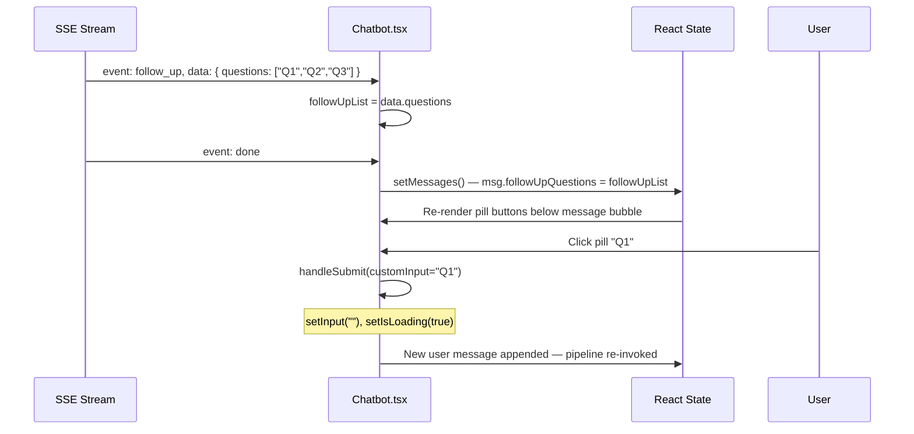

---

## F-03: Text Selection and Context Injection

**Source:** `components/chatbot_components/TextSelectionHandler.tsx`, `ChatbotShell.tsx`, `Chatbot.tsx`, `agents/chatGraph.ts`

The `activeContext` prop propagates highlighted page text from the parent component into `Chatbot.tsx`. When non-null, a context chip is displayed at the top of the input area. The selected text is appended to the `data.context` field of the next API request. The `controllerNode` injects this context into the system prompt via `generatePersonalisationContext()` under an `ACTIVE PAGE CONTEXT (CRITICAL)` heading, directing the chatbot to address the highlighted text directly.

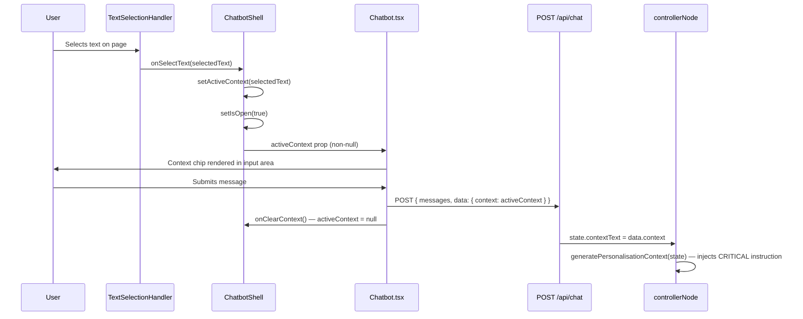

---

## F-04: Starter Cards and Greeting

**Source:** `components/chatbot_components/Chatbot.tsx`

Before any messages exist, the chat panel displays a time-appropriate personalised greeting generated by `getGreeting()`, optionally personalised with the user's first name from Firebase Auth. Three starter cards trigger their respective pipeline flows on click.

Below a panel width of 460 px (`CHIP_COMPACT_BREAKPOINT`), suggestion chips collapse to icon-only mode with tooltips.

| Starter Card | Triggered Intent |
|-------------|-----------------|
| Find courses for me | `recommendation` |
| What should I learn next? | `learning_path` |
| How does the platform work? | `faq` |

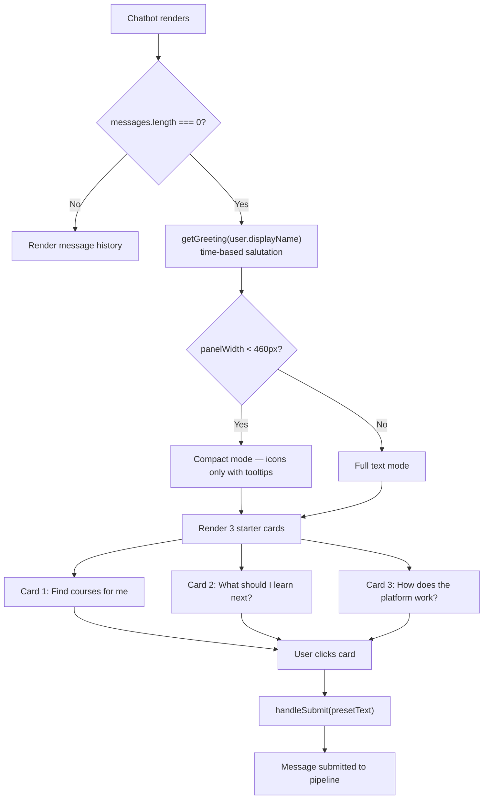

---

## F-05: Course Card UI

**Source:** `components/chatbot_components/Chatbot.tsx`

Each `course_card` SSE event renders a rich card containing: course thumbnail image (with fallback to `/images/course.jpeg`), title, vendor, difficulty badge, duration, a `Free` or price badge for paid courses, an `Enrol` button linking to the course URL and a `Platform course` badge for Journey-hosted content. Cards are rendered using `React.useMemo`-cached `parsedMessageMap` entries to avoid redundant re-parsing on non-message state changes such as loading indicators or scroll position updates.

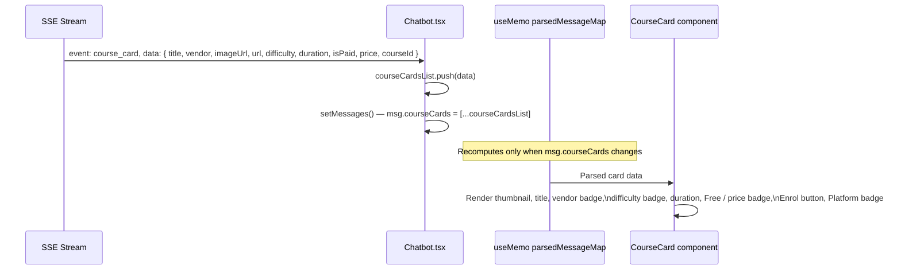

---

## F-06: Personalised Learning Roadmap UI

**Source:** `components/chatbot_components/Chatbot.tsx`

For `learning_path` responses, course cards are grouped into three collapsible accordion sections (Beginner / Intermediate / Advanced) using Radix UI's `AccordionPrimitive`. Each section displays the `stepLabel` string delivered in the SSE `course_card` event payload by the `LearningPathNode`, followed by the course cards for that tier. There is no static frontend summary constant; all section labels come from the backend. The accordion defaults to the first section open, surfacing the starting point immediately without exposing the full roadmap on initial render.

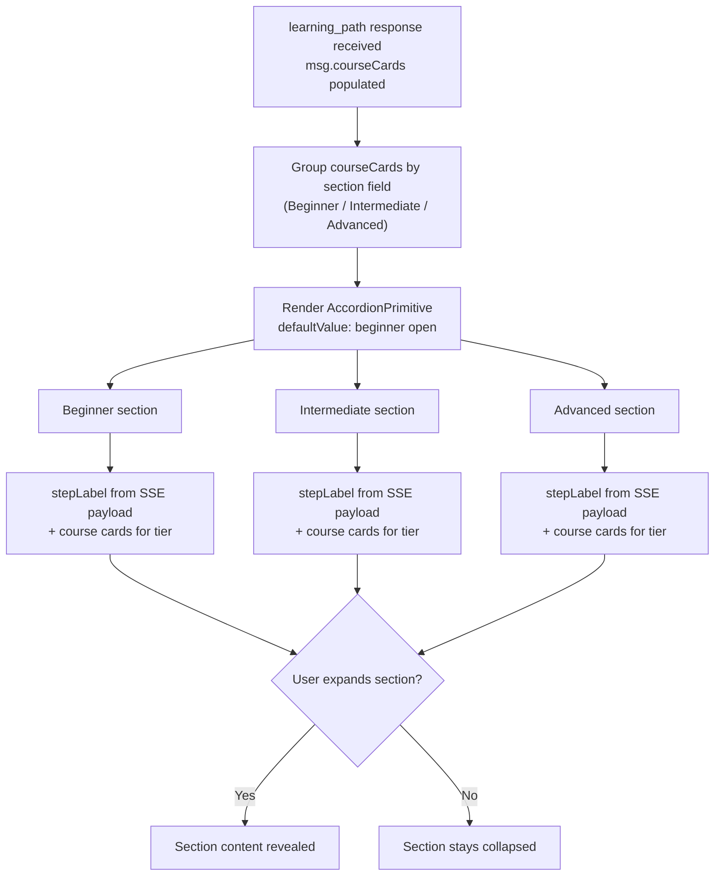

---

## F-07: Learning Path Save and Progress Tracking

**Source:** `components/chatbot_components/Chatbot.tsx`, `/api/learning-paths`

Authenticated users may save a generated learning path via a Bookmark button in the message toolbar. The saved path is written to Firestore under the user's document. A BookmarkCheck icon indicates an already-saved path. The save operation uses optimistic UI: the icon updates immediately while the Firestore write completes in the background.

Within a saved path, each course card exposes a Radix UI `CheckboxPrimitive` that toggles completion state. Progress is persisted to Firestore on each toggle. Completed courses render with strikethrough styling and reduced opacity, providing immediate visual feedback.

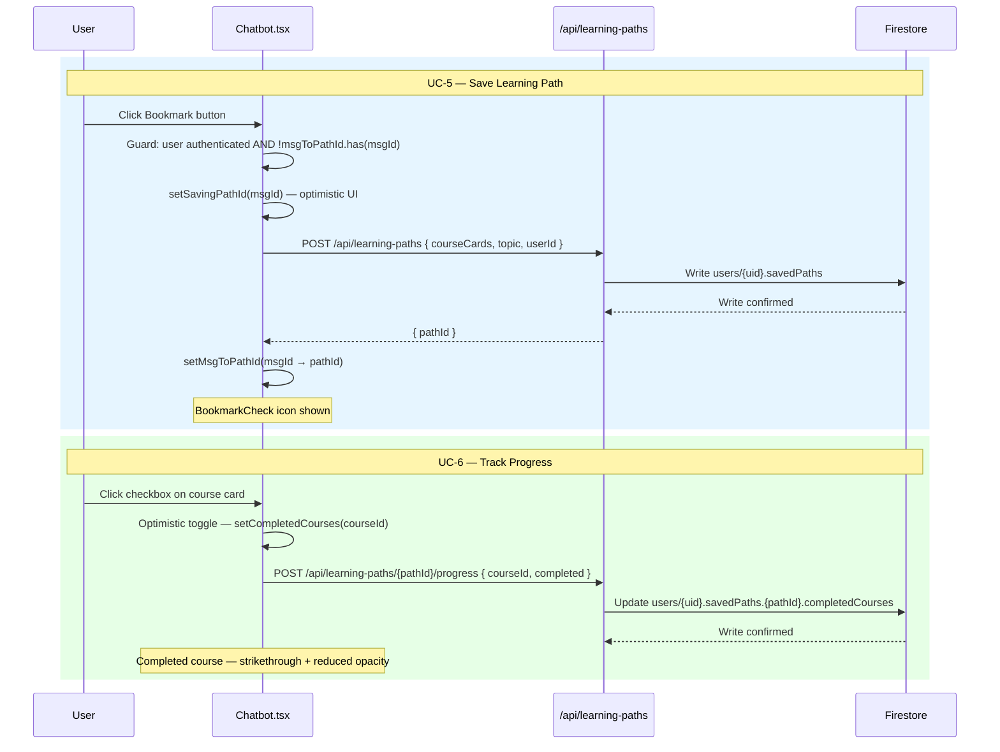

---

## F-08: Comparer UI

**Source:** `components/chatbot_components/Chatbot.tsx`

Comparison responses reuse the accordion layout from the Personalised Learning Roadmap UI. The frontend groups course cards into two collapsible accordion sections, one per topic, using Radix UI's `AccordionPrimitive`. Both sections are collapsed by default to reduce visual noise on initial render.

The `section_header` SSE events emitted by the `ComparerNode` (see [backend.md F-30](./backend.md#f-30-comparer-node)) provide the group labels. The client renders each group as a named accordion section containing up to four course cards side by side.

*No Mermaid diagram — this feature was introduced in the report and has no corresponding diagram in the legacy notes.*

---

## F-09: Session Persistence

**Source:** `components/chatbot_components/Chatbot.tsx`

Conversation history is serialised to `localStorage` on every new message. On component mount, prior messages are restored from storage. The storage key encodes the user ID (`journey-chat-{uid}`) to prevent cross-user data leakage on shared devices. Restored message objects include all structured SSE fields (`thoughtContent`, `courseCards`, `followUpQuestions`, `hallucinationWarning`) so that restored messages render identically to freshly streamed ones.

A 24-hour TTL is applied to the stored session. On mount, the stored `savedAt` timestamp is compared to `Date.now()`: if the difference exceeds 86,400,000 ms, the stored session is discarded. Legacy messages stored in the old tag-embedded format fall back to the `parseAssistantMessage()` parser for backward compatibility.

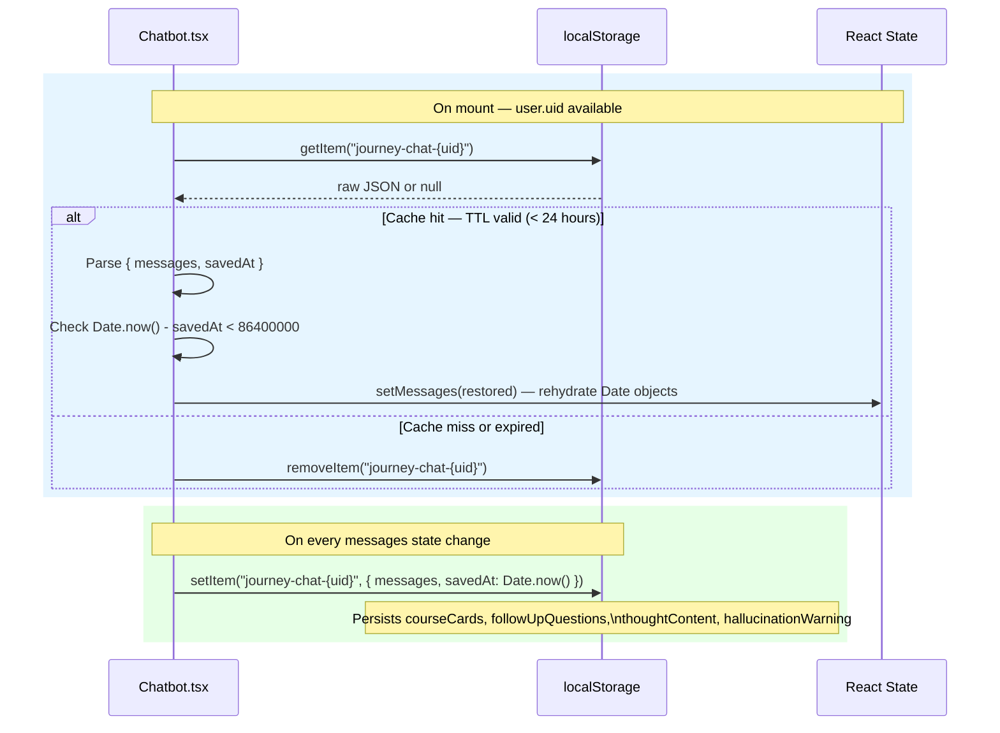

---

## F-10: Streaming Error Recovery and Retry

**Source:** `components/chatbot_components/Chatbot.tsx`

If the fetch fails or the stream closes before a `done` event is received, the partially streamed assistant message is flagged with `streamError: true`. A Retry button appears in the message toolbar. Clicking it resubmits the original message with the full conversation history intact, allowing recovery without losing prior context.

The full streaming lifecycle, including the stop-generation path, is described by the state machine below.

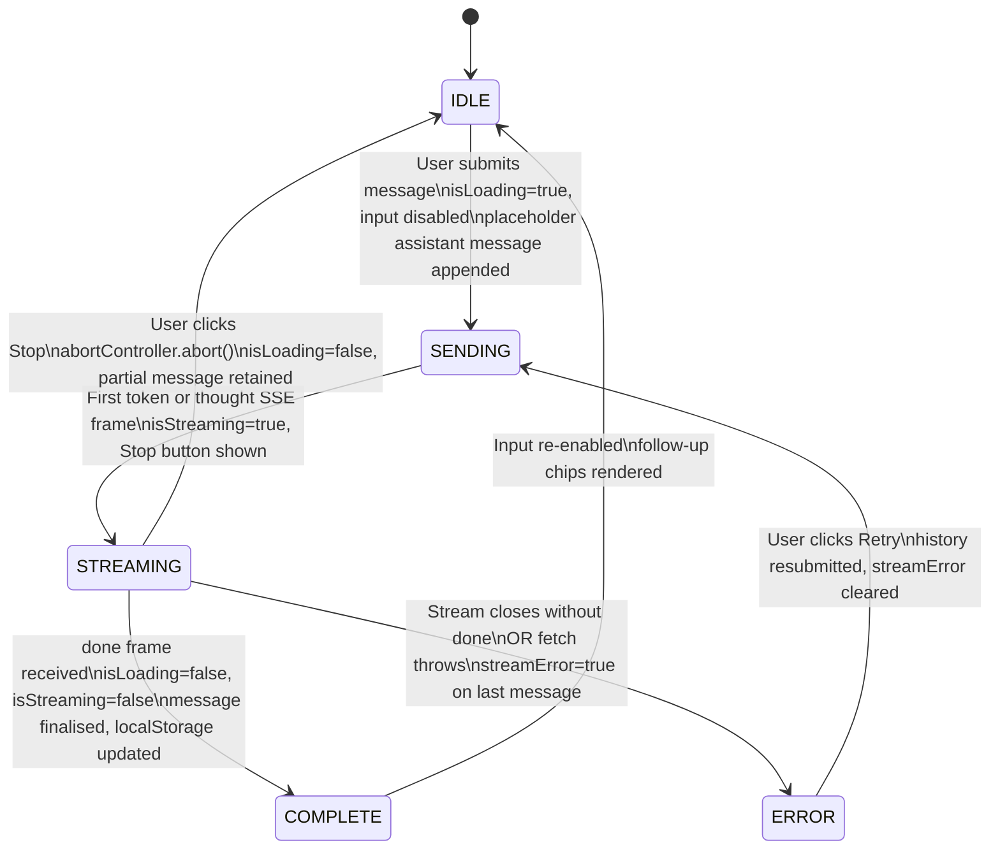

---

## F-11: Stop Generation

**Source:** `components/chatbot_components/Chatbot.tsx`

A Stop button (square icon) replaces the send button during active streaming. Clicking it calls `abort()` on the `AbortController` attached to the active `fetch`, terminating the stream immediately. The partial message is retained in the conversation history. An `AbortError` caught in the stream reader is distinguished from a network failure and does not set `streamError: true`.

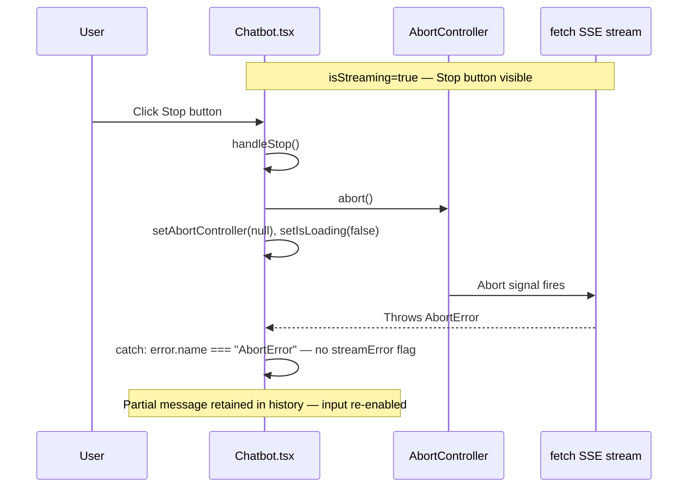

---

## F-12: Keyboard and Visual Accessibility

**Source:** `components/chatbot_components/Chatbot.tsx`, `ChatbotShell.tsx`

All interactive elements (submit button, chip buttons, course card links, accordion headers, checkboxes, retry and copy buttons) are reachable via Tab and operable via Enter or Space. Focus is trapped within the chat panel via `FocusScope` when it is open.

A single `FOCUS_RING` constant applies a consistent 2 px brand-blue (`#10527c`) outline with 2 px offset across all focusable elements, meeting WCAG 2.4.7 and 2.4.11 with a contrast ratio of 8.23:1. Submitting on Enter (without Shift) is handled by the `onKeyDown` handler on the textarea; Shift+Enter inserts a newline. All touch targets meet a minimum size suitable for mobile use (NFR-9).

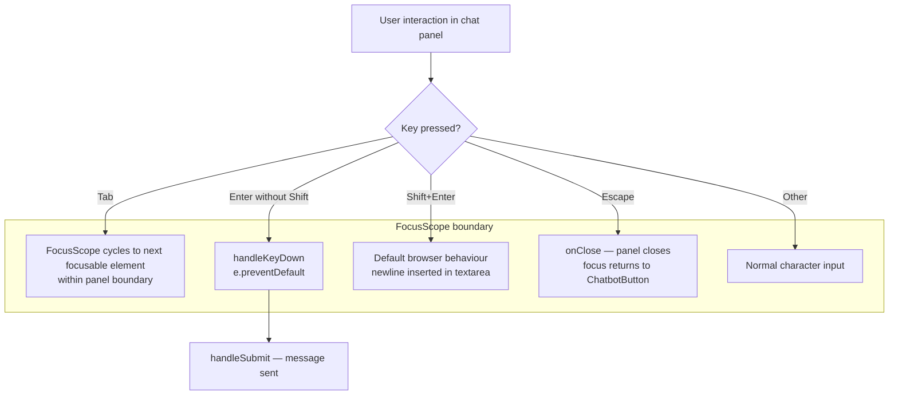

---

## F-13: Error Boundary

**Source:** `components/chatbot_components/ChatbotShell.tsx`

A React Error Boundary (`ChatbotErrorBoundary`) wraps the `Chatbot` component. Any unhandled rendering exception is caught, logged to the console and replaced with a fallback panel containing a `role=alertdialog` element and a Try again button. This prevents a broken chat panel from crashing the host page.

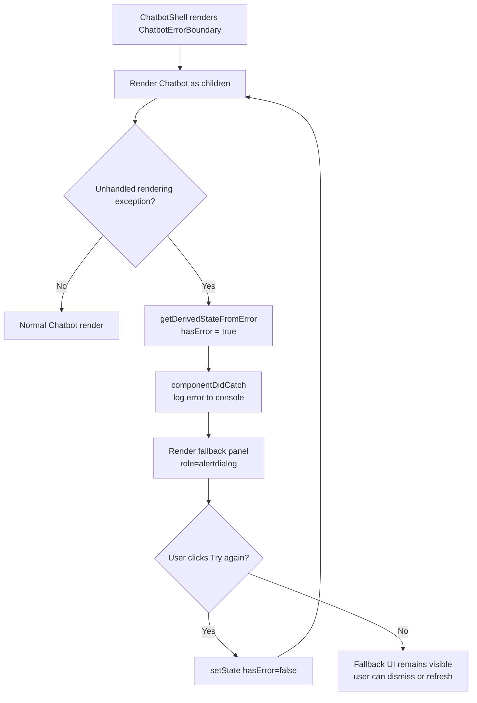

---

## F-14: Hallucination Warning Banner

**Source:** `components/chatbot_components/Chatbot.tsx`, `agents/outputGuardAgent.ts`, `agents/controllerAgent.ts`

When the stream includes a `hallucination_warning` SSE event, a yellow advisory banner is rendered below the assistant message, informing the user that the response may contain unverified information and encouraging independent verification. The stream is not blocked; the full response is still delivered. This surfaces uncertainty explicitly rather than suppressing uncertain responses.

The `hallucination_warning` event is emitted by the Output Guard's Layer 3 grounding heuristic when no provenance markers (`[COURSE_CARD]`, `[FAQ_RESULT]`, `[RECOMMENDATION_META]`) are present and the response contains two or more external-claim patterns. See [backend.md F-23](./backend.md#f-23-output-guard-agent) for the full grounding heuristic logic.

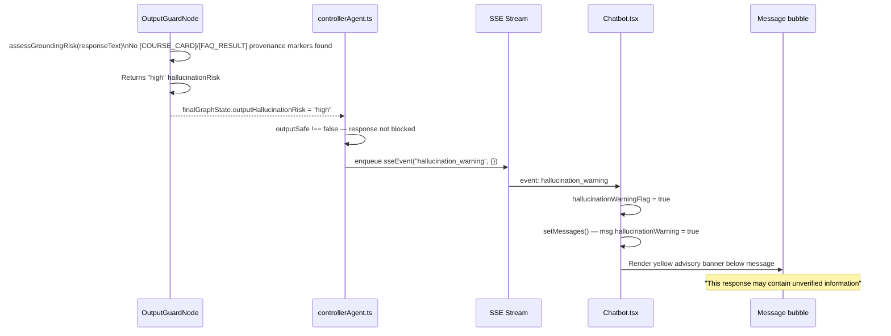

---

## F-15: Markdown Rendering with Syntax Highlighting

**Source:** `components/chatbot_components/Chatbot.tsx`

Assistant message text is rendered via `react-markdown`. Code blocks are syntax-highlighted using `react-syntax-highlighter` with the `atomDark` Prism theme. Markdown headers, bold text and bullet lists are supported, enabling the formatting rules defined in `agents/agentConfig.json` to render correctly in the chat bubble.

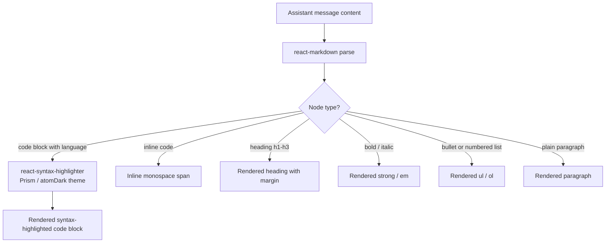

---

## F-16: Auto-resizing Textarea

**Source:** `components/chatbot_components/Chatbot.tsx`

The input textarea uses a `useEffect` hook that resets its height to `auto` and then sets it to `scrollHeight` on every content change, allowing the textarea to grow with the user's input. A `max-h` constraint caps expansion at 150 px, preventing the input area from consuming the full panel height.

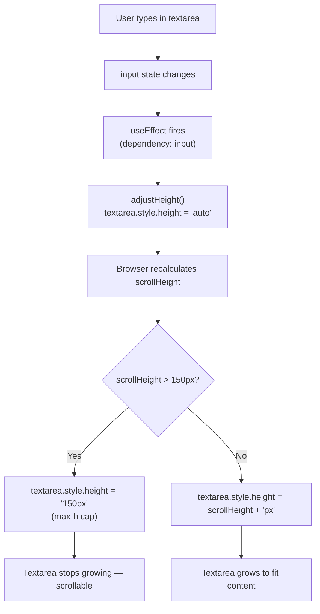

---

## F-17: Scroll-to-Bottom and Auto-scroll

**Source:** `components/chatbot_components/Chatbot.tsx`

A floating scroll-to-bottom button (ChevronDown icon) appears when the user has scrolled up more than 100 px from the bottom. Auto-scroll to new messages is suppressed while the user is reading history and re-enabled when they scroll back to the bottom or a new stream begins.

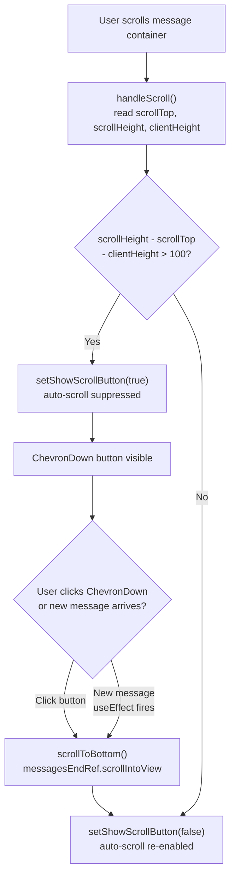

---

## F-18: Action Buttons

**Source:** `components/chatbot_components/Chatbot.tsx`, `app/api/chat/feedback/route.ts`

Each assistant message exposes a toolbar of contextual action buttons. All buttons include `aria-label` and `title` attributes and are reachable via the panel-wide focus ring.

| Button | Visibility | Behaviour |
|--------|-----------|-----------|
| Copy | Always | Writes clean plain text to the clipboard via `navigator.clipboard.writeText()`; icon transitions to a checkmark for 2 seconds |
| Thumbs Up / Down | Always | Persists feedback to Firestore via `POST /api/chat/feedback`; uses optimistic UI with `feedbackMap` state |
| Retry | On `streamError` only | Filters the errored message from history, appends a new placeholder and re-invokes the fetch pipeline |
| Bookmark / BookmarkCheck | On `learning_path` messages only | Saves or indicates a saved learning path (see F-07) |

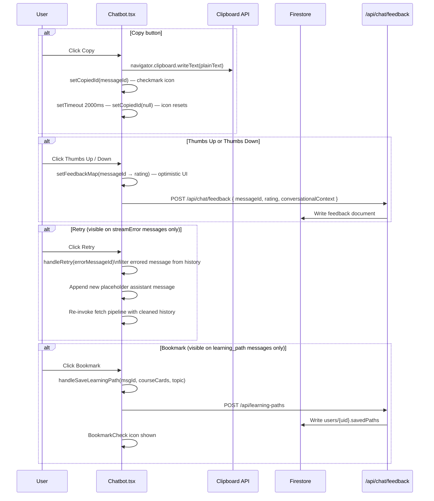

---

## F-19: Reasoning Trace Popover

**Source:** `components/chatbot_components/Chatbot.tsx`

Each assistant message exposes a Reasoning button that reveals the multi-agent pipeline's reasoning for that response. Clicking it opens a Radix UI Popover displaying the Agent Collaboration Log. The log parses the `thought` SSE event content for four structured tags and renders them as labelled steps.

| Tag | Step Name | Content |
|-----|-----------|---------|
| `[CLASSIFIER]` | Classification | Intent identified and routing decision |
| `[RESEARCHER]` | Research | Retrieved context or query signals used |
| `[CURATOR]` | Curation | How results were filtered or ranked |
| `[SAFETY]` | Safety | Safety assessment of the response |

The `thought` content is stored in the `thoughtContent` field of the message object during streaming (dispatched by the client-side SSE ingestion pipeline when a `thought` event is received). It is persisted to `localStorage` as part of the message object, so the reasoning trace remains accessible after page navigation.

The `recommendation_meta` payload (also stored on the message) provides the underlying scoring signals (`query`, `skillLevel`, `scores[]`) that drove the retrieval decision, available for explainability queries.

*No Mermaid diagram — this feature was introduced in the report and has no corresponding diagram in the legacy notes.*

---

## Referenced files

All paths are relative to `fyp_codebase/Lifelong-Learning-App/`.

| File | Description |
|------|-------------|
| `components/chatbot_components/Chatbot.tsx` | Main chat UI: SSE ingestion, message rendering, session persistence and all F-01 to F-19 features |
| `components/chatbot_components/ChatbotShell.tsx` | Chat widget container, open/close state and error boundary (F-01, F-12, F-13) |
| `components/chatbot_components/TextSelectionHandler.tsx` | Captures selected page text and injects it as chat context (F-03) |
| `app/api/chat/route.ts` | Server-side SSE stream emitter |
| `app/api/chat/feedback/route.ts` | Persists thumbs-up/down feedback ratings (F-18) |
| `agents/chatGraph.ts` | `controllerNode` context injection via `generatePersonalisationContext()` (F-03) |
| `agents/controllerAgent.ts` | SSE emission and hallucination warning logic (F-14) |
| `agents/outputGuardAgent.ts` | Grounding heuristic that triggers the hallucination warning event (F-14) |
